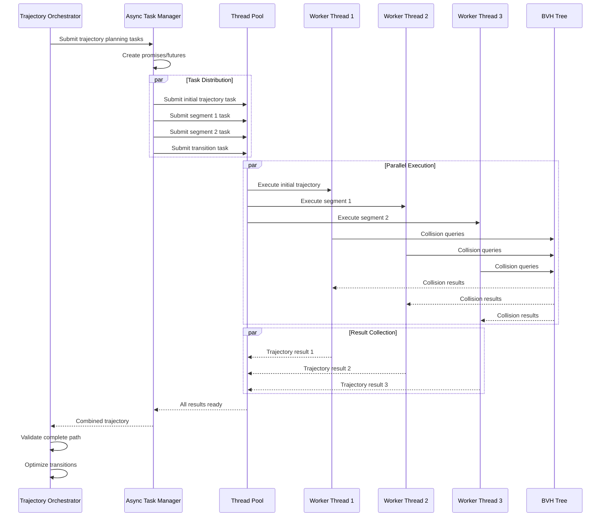

# Robotic Ultrasound System (RUS) - Comprehensive System Architecture Documentation

## Executive Summary

This document presents an exhaustive technical analysis of the Robotic Ultrasound System (RUS) architecture—a sophisticated, multi-layered robotics platform engineered for autonomous medical imaging applications. The system represents a paradigm shift in healthcare delivery, combining advanced trajectory optimization algorithms, real-time collision detection, force-controlled manipulation, and distributed computing architectures to create a clinically viable automated ultrasound scanning solution.

The RUS architecture demonstrates exceptional engineering sophistication through its implementation of Stochastic Trajectory Optimization for Motion Planning (STOMP), hierarchical Bounding Volume Hierarchy (BVH) trees for spatial reasoning, and a comprehensive multi-threaded execution framework. This analysis reveals design patterns that extend far beyond traditional robotic systems, incorporating medical-grade safety protocols, real-time performance guarantees, and extensible plugin architectures suitable for diverse clinical applications.

## Table of Contents

1. [System Overview & Philosophy](#system-overview--philosophy)
2. [Architectural Deep Dive](#architectural-deep-dive)
3. [Core Library Analysis](#core-library-analysis)
4. [Advanced UML Modeling](#advanced-uml-modeling)
5. [Dynamic Behavior Analysis](#dynamic-behavior-analysis)
6. [Performance & Optimization](#performance--optimization)
7. [Safety & Reliability Engineering](#safety--reliability-engineering)
8. [Clinical Integration Framework](#clinical-integration-framework)
9. [Advanced Features & Extensions](#advanced-features--extensions)
10. [Deployment Architecture](#deployment-architecture)
11. [Future Evolution Roadmap](#future-evolution-roadmap)

## System Overview & Philosophy

### Architectural Philosophy

The RUS system embodies a **Multi-Layer Abstraction Architecture** (MLAA) that separates concerns across distinct functional domains while maintaining tight integration through well-defined interfaces. This architectural philosophy enables:

1. **Domain Separation**: Medical domain logic (USLib) isolated from generic robotics (TrajectoryLib)
2. **Algorithmic Flexibility**: Plugin-based algorithm selection with runtime configuration
3. **Safety-First Design**: Multi-level safety guarantees with graceful degradation
4. **Scalable Performance**: Horizontal scaling through distributed computing patterns
5. **Clinical Compliance**: Built-in validation and auditing capabilities

### System Taxonomy

The RUS system can be classified as a **Hybrid Autonomous Robotic Medical Device (HARMD)** with the following characteristics:

- **Autonomous Operation**: Self-contained decision-making and execution
- **Human-in-the-Loop**: Supervised autonomy with intervention capabilities  
- **Safety-Critical**: Medical-grade reliability and fail-safe mechanisms
- **Real-Time**: Hard timing constraints for patient safety
- **Adaptive**: Learning-enabled optimization and personalization

### Core Design Principles

1. **Modularity**: Component-based architecture with clear interfaces
2. **Extensibility**: Plugin architectures for algorithm and sensor integration
3. **Reliability**: Redundant systems and graceful failure handling
4. **Performance**: Multi-threaded, cache-optimized implementations
5. **Maintainability**: Comprehensive logging, monitoring, and diagnostic capabilities
6. **Interoperability**: Standards-compliant interfaces (DICOM, HL7 FHIR, ROS)

## Architectural Deep Dive

### Hierarchical System Architecture

```
┌─────────────────────────────────────────────────────────────────────────────────┐
│                         Clinical Application Layer                              │
├─────────────────────────────────────────────────────────────────────────────────┤
│  Patient UI  │  Clinician Dashboard  │  Quality Assurance  │  Remote Monitoring │
├─────────────────────────────────────────────────────────────────────────────────┤
│                         Medical Domain Layer (USLib)                           │
├─────────────────────────────────────────────────────────────────────────────────┤
│ USTrajectoryPlanner │ USScanningController │ ForceRegistrationOrchestrator      │
│ ClariusInterface    │ CartesianImpedance   │ ContactRegistrationUpdater         │
├─────────────────────────────────────────────────────────────────────────────────┤
│                        Motion Planning Layer (TrajectoryLib)                   │
├─────────────────────────────────────────────────────────────────────────────────┤
│ MotionGenerator │ PathPlanner │ RobotArm │ RobotManager │ Planning Algorithms    │
│ STOMP Engine    │ RRT* Suite  │ Kinematics│ URDF Parser  │ Cost Calculators      │
├─────────────────────────────────────────────────────────────────────────────────┤
│                        Geometric Reasoning Layer (GeometryLib)                 │
├─────────────────────────────────────────────────────────────────────────────────┤
│ BVHTree        │ Obstacle     │ STLProcessor │ SDF Generator │ Collision Detection │
│ Spatial Index  │ Management   │ Mesh Ops    │ Distance Fields│ Intersection Tests │
├─────────────────────────────────────────────────────────────────────────────────┤
│                            Hardware Abstraction Layer                          │
├─────────────────────────────────────────────────────────────────────────────────┤
│ Robot Drivers  │ Sensor APIs  │ Force Controllers │ Safety Systems │ I/O Management│
└─────────────────────────────────────────────────────────────────────────────────┘
```

### Information Flow Architecture

The system implements a **Hierarchical Information Processing Model** with multiple data streams:

1. **Command Flow**: Top-down directive propagation
2. **Sensor Fusion**: Multi-modal data integration
3. **Feedback Loops**: Real-time state monitoring and correction
4. **Event Propagation**: Asynchronous event handling across layers
5. **Audit Trails**: Comprehensive logging for medical compliance

## Core Library Analysis

### USLib: Medical Domain Specialization

The USLib represents the medical domain abstraction layer, providing ultrasound-specific functionality while maintaining clean interfaces to the underlying robotic infrastructure.

#### UltrasoundScanTrajectoryPlanner: Orchestration Engine

**Architecture Pattern**: Coordinator/Orchestrator with Command pattern implementation

```cpp
class UltrasoundScanTrajectoryPlanner {
private:
    // Core Dependencies - Dependency Injection Pattern
    std::unique_ptr<RobotArm> _arm;                    // Kinematics engine
    std::shared_ptr<BVHTree> _obstacleTree;           // Spatial reasoning
    std::unique_ptr<MotionGenerator> _motionGenerator; // Trajectory optimization
    std::unique_ptr<PathPlanner> _pathPlanner;        // High-level planning
    
    // State Management
    Eigen::VectorXd _currentJoints;                   // Robot configuration
    std::vector<Eigen::Affine3d> _poses;             // Scan waypoints
    std::string _environment;                         // Obstacle description
    
    // Execution Context
    std::vector<std::pair<std::vector<MotionGenerator::TrajectoryPoint>, bool>> _trajectories;
    
    // Advanced Features
    RobotManager _robotManager;                       // Environment management
    std::vector<TrajectoryTask> _asyncTasks;         // Parallel execution
    
public:
    // Configuration Interface
    void setCurrentJoints(const Eigen::VectorXd& joints);
    void setEnvironment(const std::string& environment);
    void setPoses(const std::vector<Eigen::Affine3d>& poses);
    
    // Execution Interface
    bool planTrajectories();                          // Main orchestration
    std::vector<std::pair<std::vector<MotionGenerator::TrajectoryPoint>, bool>> getTrajectories();
    
    // Advanced Query Interface
    std::vector<Eigen::Affine3d> getScanPoses() const;
    MotionGenerator* getMotionGenerator() const;
    PathPlanner* getPathPlanner() const;
    
private:
    // Internal Algorithms
    std::pair<std::vector<MotionGenerator::TrajectoryPoint>, bool> 
        planSingleStompTrajectory(const Eigen::VectorXd& start, 
                                 const Eigen::VectorXd& target, 
                                 const StompConfig& config);
};
```

**Key Design Insights**:

1. **Composition over Inheritance**: Aggregates specialized components rather than extending base classes
2. **Async Task Management**: Uses futures/promises for parallel trajectory computation
3. **Configuration Separation**: Clean separation between setup and execution phases
4. **Error Handling**: Comprehensive exception handling with detailed error reporting
5. **Resource Management**: RAII patterns with smart pointer usage

### TrajectoryLib: Motion Planning Engine

The TrajectoryLib implements sophisticated motion planning algorithms with a focus on real-time performance and safety guarantees.

#### MotionGenerator: STOMP Implementation Deep Dive

**Algorithm**: Stochastic Trajectory Optimization for Motion Planning with Policy Gradients

```cpp
class MotionGenerator {
private:
    // Core Algorithm State
    std::unique_ptr<CompositeCostCalculator> _costCalculator;  // Pluggable cost system
    std::vector<TrajectoryPoint> _path;                        // Optimized trajectory
    Eigen::MatrixXd _waypoints;                               // Constraint points
    
    // Robot Model
    RobotArm _arm;                                            // Kinematic model
    std::shared_ptr<BVHTree> _obstacleTree;                   // Collision world
    
    // Algorithm Parameters
    double _explorationConstant;                              // Noise scaling
    std::vector<double> _maxJointVelocities;                 // Dynamic limits
    std::vector<double> _maxJointAccelerations;              // Dynamic limits
    
    // Performance Optimization
    Eigen::MatrixXd _M, _R, _L;                              // Precomputed matrices
    bool _matricesInitialized;                               // Lazy initialization
    
    // Spatial Acceleration Structures
    std::vector<std::vector<std::vector<double>>> _sdf;      // Signed distance field
    Eigen::Vector3d _sdfMinPoint, _sdfMaxPoint;              // SDF bounds
    double _sdfResolution;                                    // SDF discretization
    bool _sdfInitialized;                                     // Lazy SDF generation
    
public:
    struct TrajectoryPoint {
        std::vector<double> position;                         // Joint configuration
        std::vector<double> velocity;                         // Joint velocities
        std::vector<double> acceleration;                     // Joint accelerations
        double time;                                          // Temporal stamp
    };
    
    // Configuration Interface
    void setWaypoints(const Eigen::MatrixXd& waypoints);
    void setObstacleTree(const std::shared_ptr<BVHTree>& tree);
    void setExplorationConstant(double constant);
    
    // Algorithm Execution
    bool performSTOMP(const StompConfig& config, 
                     std::shared_ptr<boost::asio::thread_pool> pool = nullptr);
    bool performSTOMPWithCheckpoints(const std::vector<Eigen::VectorXd>& checkpoints,
                                    std::vector<TrajectoryPoint> initialTrajectory,
                                    const StompConfig& config,
                                    std::shared_ptr<boost::asio::thread_pool> pool = nullptr);
    
    // Advanced Features
    bool performSTOMPWithEarlyTermination(const StompConfig& config,
                                         std::shared_ptr<boost::asio::thread_pool> pool,
                                         std::vector<Eigen::MatrixXd>& intermediateThetas);
    
    // Analysis & Diagnostics
    TrajectoryEvaluation evaluateTrajectory(const Eigen::MatrixXd& trajectory, double dt);
    bool finaliseTrajectory(double jerkLimit = 0.5);
    
    // Query Interface
    std::vector<TrajectoryPoint> getPath() const;
    
private:
    // Core Algorithm Implementation
    Eigen::MatrixXd generateNoisyTrajectory(const Eigen::MatrixXd& baseTrajectory,
                                          const Eigen::VectorXd& stdDevs,
                                          const std::vector<std::pair<double, double>>& limits);
    
    std::vector<Eigen::MatrixXd> generateNoisyTrajectories(/* parameters */);
    
    Eigen::MatrixXd applyProbabilisticUpdate(const Eigen::MatrixXd& currentTrajectory,
                                           const std::vector<Eigen::MatrixXd>& samples,
                                           const Eigen::VectorXd& probabilities,
                                           double learningRate);
    
    // Performance-Critical Methods
    double computeTrajectoryCost(const Eigen::MatrixXd& theta, double dt);
    bool armHasCollision(const std::vector<double>& jointPositions);
    void initializeMatrices(const int& N, const double& dt);
    
    // Time Optimization
    std::vector<TrajectoryPoint> computeTimeOptimalScaling(const std::vector<TrajectoryPoint>& path);
    std::vector<TrajectoryPoint> computeTimeOptimalSegment(const TrajectoryPoint& start, 
                                                          const TrajectoryPoint& end, 
                                                          double startTime);
};
```

#### Cost Calculator Hierarchy: Pluggable Optimization Objectives

The cost calculator system implements a **Strategy Pattern** with **Composite Pattern** for flexible optimization objective composition:

```cpp
// Abstract Base Class
class CostCalculator {
public:
    virtual double computeCost(const Eigen::MatrixXd& trajectory, double dt) = 0;
    virtual ~CostCalculator() = default;
};

// Composite Implementation
class CompositeCostCalculator : public CostCalculator {
private:
    std::vector<std::unique_ptr<CostCalculator>> _costCalculators;
    std::vector<double> _weights;
    
public:
    void addCostCalculator(std::unique_ptr<CostCalculator> calculator, double weight);
    double computeCost(const Eigen::MatrixXd& trajectory, double dt) override;
};

// Specialized Implementations
class ObstacleCostCalculator : public CostCalculator {
private:
    RobotArm _arm;
    std::shared_ptr<BVHTree> _obstacleTree;
    std::vector<std::vector<std::vector<double>>> _sdf;  // Precomputed distance field
    
public:
    double computeCost(const Eigen::MatrixXd& trajectory, double dt) override;
};

class TaskSpacePathTrackingCostCalculator : public CostCalculator {
private:
    RobotArm _arm;
    std::vector<Eigen::Vector3d> _taskSpacePositions;
    std::vector<Eigen::Matrix3d> _taskSpaceOrientations;
    std::vector<double> _cumulativeDistances;
    double _totalDistance;
    double _positionWeight, _orientationWeight;
    
public:
    TaskSpacePathTrackingCostCalculator(RobotArm arm,
                                       const std::vector<Eigen::VectorXd>& jointCheckpoints,
                                       double positionWeight = 2.0,
                                       double orientationWeight = 1.0);
    
    double computeCost(const Eigen::MatrixXd& trajectory, double dt) override;
    
private:
    std::pair<Eigen::Vector3d, Eigen::Matrix3d> interpolateTaskSpacePath(double s);
};
```

### GeometryLib: Spatial Reasoning Engine

The GeometryLib provides high-performance spatial data structures and geometric algorithms optimized for real-time robotics applications.

#### BVHTree: Hierarchical Spatial Indexing

**Algorithm**: Bounding Volume Hierarchy with Surface Area Heuristic (SAH) construction

```cpp
class BVHTree {
private:
    std::unique_ptr<BVHNode> _root;
    
    // Construction Parameters
    static constexpr size_t MAX_PRIMITIVES_PER_LEAF = 4;
    static constexpr int MAX_DEPTH = 64;
    
public:
    // Construction
    explicit BVHTree(const std::vector<std::shared_ptr<Obstacle>>& obstacles);
    
    // Spatial Queries - O(log n) performance
    bool isSegmentIntersecting(const Vec3& start, const Vec3& end) const;
    bool isBoxIntersecting(const Vec3& center, const Vec3& halfDims, 
                          const Eigen::Matrix3d& axes) const;
    
    // Distance Queries with Gradients
    std::tuple<double, Vec3> getDistanceAndGradient(const Vec3& point) const;
    std::tuple<double, Vec3, Vec3> getDistanceAndClosestPoint(const Vec3& point) const;
    
    // SDF Generation for Optimization
    std::vector<std::vector<std::vector<double>>> toSDF(const Eigen::Vector3d& min_point,
                                                       const Eigen::Vector3d& max_point,
                                                       double resolution) const;
    
private:
    // Construction Algorithms
    std::unique_ptr<BVHNode> buildRecursive(std::vector<std::shared_ptr<Obstacle>>& obstacles,
                                           int depth = 0);
    
    // Optimization Heuristics
    int findBestSplit(const std::vector<std::shared_ptr<Obstacle>>& obstacles,
                     int& bestAxis, double& bestCost);
    
    // Query Implementations
    bool intersectRecursive(const BVHNode* node, const Vec3& start, const Vec3& end) const;
    double distanceRecursive(const BVHNode* node, const Vec3& point, Vec3& gradient) const;
};

class BVHNode {
public:
    Eigen::AlignedBox3d boundingBox;                    // Axis-aligned bounding box
    std::unique_ptr<BVHNode> left, right;               // Child nodes
    std::vector<std::shared_ptr<Obstacle>> obstacles;   // Leaf primitives
    
    // Performance optimization
    bool isLeaf() const { return left == nullptr && right == nullptr; }
    size_t getTriangleCount() const;
    double getSurfaceArea() const;
};
```

## UML Class Diagrams

### USLib Core Classes

```mermaid
classDiagram
    class UltrasoundScanTrajectoryPlanner {
        -RobotArm* _arm
        -shared_ptr~BVHTree~ _obstacleTree
        -MotionGenerator* _motionGenerator
        -PathPlanner* _pathPlanner
        -RobotManager _robotManager
        -VectorXd _currentJoints
        -string _environment
        -vector~Affine3d~ _poses
        -vector~pair~TrajectoryPoint, bool~~ _trajectories
        -vector~TrajectoryTask~ _asyncTasks
        +UltrasoundScanTrajectoryPlanner(string urdf)
        +~UltrasoundScanTrajectoryPlanner()
        +setCurrentJoints(VectorXd joints) void
        +setEnvironment(string environment) void
        +setPoses(vector~Affine3d~ poses) void
        +planTrajectories() bool
        +getTrajectories() vector~pair~TrajectoryPoint, bool~~
        +getScanPoses() vector~Affine3d~
        +getMotionGenerator() MotionGenerator*
        +getPathPlanner() PathPlanner*
        -planSingleStompTrajectory(VectorXd start, VectorXd target, StompConfig config) pair~TrajectoryPoint, bool~
    }

    class USScanningController {
        <<interface>>
        +startScanning() bool
        +pauseScanning() bool
        +stopScanning() bool
        +getScanProgress() double
        +getScanQuality() QualityMetrics
    }

    class ClariusInterface {
        <<interface>>
        -string _deviceId
        -ScanParameters _parameters
        +connect() bool
        +disconnect() bool
        +startImageAcquisition() bool
        +stopImageAcquisition() bool
        +getImage() UltrasoundImage
        +setGain(double gain) void
        +setDepth(double depth) void
    }

    class CartesianImpedanceInterface {
        <<interface>>
        -Matrix6d _stiffness
        -Matrix6d _damping
        -Vector6d _targetWrench
        +setStiffness(Matrix6d K) void
        +setDamping(Matrix6d D) void
        +setTargetWrench(Vector6d F) void
        +getCurrentWrench() Vector6d
        +enable() bool
        +disable() bool
    }

    %% TrajectoryLib Core Classes
    class MotionGenerator {
        -RobotArm _arm
        -shared_ptr~BVHTree~ _obstacleTree
        -unique_ptr~CompositeCostCalculator~ _costCalculator
        -vector~TrajectoryPoint~ _path
        -MatrixXd _waypoints
        -MatrixXd _M, _R, _L
        -bool _matricesInitialized
        -double _explorationConstant
        -vector~double~ _maxJointVelocities
        -vector~double~ _maxJointAccelerations
        -vector~vector~vector~double~~~ _sdf
        -Vector3d _sdfMinPoint, _sdfMaxPoint
        -double _sdfResolution
        -bool _sdfInitialized
        +MotionGenerator(RobotArm arm)
        +setWaypoints(MatrixXd waypoints) void
        +setObstacleTree(shared_ptr~BVHTree~ tree) void
        +performSTOMP(StompConfig config, shared_ptr~thread_pool~ pool) bool
        +performSTOMPWithCheckpoints(vector~VectorXd~ checkpoints, vector~TrajectoryPoint~ initial, StompConfig config, shared_ptr~thread_pool~ pool) bool
        +performSTOMPWithEarlyTermination(StompConfig config, shared_ptr~thread_pool~ pool, vector~MatrixXd~ intermediate) bool
        +getPath() vector~TrajectoryPoint~
        +evaluateTrajectory(MatrixXd trajectory, double dt) TrajectoryEvaluation
        +finaliseTrajectory(double jerkLimit) bool
        +armHasCollision(vector~double~ positions) bool
        +saveTrajectoryToCSV(string filename) void
        -generateNoisyTrajectories(MatrixXd base, VectorXd stdDevs, vector~pair~double,double~~ limits) vector~MatrixXd~
        -applyProbabilisticUpdate(MatrixXd current, vector~MatrixXd~ samples, VectorXd probabilities, double learningRate) MatrixXd
        -computeTrajectoryCost(MatrixXd theta, double dt) double
        -initializeMatrices(int N, double dt) void
        -computeTimeOptimalScaling(vector~TrajectoryPoint~ path) vector~TrajectoryPoint~
    }

    class RobotArm {
        -vector~shared_ptr~Link~~ _links
        -vector~shared_ptr~Joint~~ _joints
        -vector~pair~double,double~~ _jointLimits
        -unordered_map~string,QSharedPointer~QEntity~~ _linkEntities
        -vector~unordered_map~string,QSharedPointer~QEntity~~~ _ghostEntitiesList
        +RobotArm(string urdf_file)
        +RobotArm(RobotArm other)
        +parseURDF(string urdf_file) void
        +getJointAngles() VectorXd
        +setJointAngles(VectorXd angles) void
        +setJointAngle(string joint_name, double angle) void
        +getEndeffectorPose() Affine3d
        +getEndeffectorTransform() Affine3d
        +getJointPosition(int joint_idx) Vector3d
        +getJointAxis(int joint_idx) Vector3d
        +getJointRotation(int joint_idx) Matrix3d
        +computeJacobian(MatrixXd J) void
        +moveToCartesian(Vector3d point, Matrix3d axes) bool
        +moveToCartesian(Vector3d point, Vector3d angles) bool
        +isViolating() bool
        +computeManipulability() double
        +getTaskState(Matrix~6,1~ limits) TaskState
        +getJointState() JointState
        +moveToTaskState(TaskState state, Matrix~6,1~ limits) bool
        +moveToJointState(JointState state) bool
        +getLinks() vector~shared_ptr~Link~~
        +getLinkBoundingBoxes() vector~tuple~Vector3d,Vector3d,Matrix3d~~
        +getCollisionBoxes() vector~tuple~Vector3d,Vector3d,Matrix3d~~
        +getLinkInertias() vector~Matrix3d~
        +getLinkCentersOfMass() vector~Vector3d~
        +getLinkMasses() vector~double~
        +getEffortLimits() VectorXd
        +getVelocityLimits() VectorXd
        +jointLimits() vector~pair~double,double~~
        +setJointLimits(vector~pair~double,double~~ limits) void
        +createEntities(QEntity rootEntity) void
        +updateEntities() void
        +deleteEntities() void
        +createGhostEntities(QEntity rootEntity) void
        +deleteGhostEntities() void
        -calculateLinkTransform(shared_ptr~Joint~ joint, Affine3d parent_transform) void
        -computeBBoxLimits() void
        -populateEmptyLinks() void
    }

    class Link {
        +string name
        +string mesh_file
        +Vector3d translation
        +Vector3d rotation
        +Vector3d _minBBox, _maxBBox
        +bool _bBox
        +vector~tuple~Vector3d,Vector3d,Matrix3d~~ obbs
        +double mass
        +Matrix3d inertia
        +Vector3d center_of_mass
        +Link()
        +Link(Link other)
        +operator=(Link other) Link
    }

    class Joint {
        +string name
        +string type
        +shared_ptr~Link~ parent
        +shared_ptr~Link~ child
        +Vector3d origin_translation
        +Vector3d origin_rotation
        +Vector3d axis
        +double angle
        +double limit_min, limit_max
        +double effort_limit
        +double velocity_limit
        +Joint()
        +Joint(Joint other)
        +operator=(Joint other) Joint
    }

    %% Cost Calculator Hierarchy
    class CostCalculator {
        <<abstract>>
        +computeCost(MatrixXd trajectory, double dt) double*
        +~CostCalculator()*
    }

    class CompositeCostCalculator {
        -vector~unique_ptr~CostCalculator~~ _costCalculators
        -vector~double~ _weights
        +addCostCalculator(unique_ptr~CostCalculator~ calc, double weight) void
        +computeCost(MatrixXd trajectory, double dt) double
    }

    class ObstacleCostCalculator {
        -RobotArm _arm
        -shared_ptr~BVHTree~ _obstacleTree
        -vector~vector~vector~double~~~ _sdf
        -Vector3d _sdfMinPoint, _sdfMaxPoint
        -double _sdfResolution
        +ObstacleCostCalculator(RobotArm arm, shared_ptr~BVHTree~ tree, vector~vector~vector~double~~~ sdf, Vector3d min, Vector3d max, double res)
        +computeCost(MatrixXd trajectory, double dt) double
    }

    class TaskSpacePathTrackingCostCalculator {
        -RobotArm _arm
        -vector~Vector3d~ _taskSpacePositions
        -vector~Matrix3d~ _taskSpaceOrientations
        -vector~double~ _cumulativeDistances
        -double _totalDistance
        -double _positionWeight, _orientationWeight
        +TaskSpacePathTrackingCostCalculator(RobotArm arm, vector~VectorXd~ checkpoints, double posWeight, double oriWeight)
        +computeCost(MatrixXd trajectory, double dt) double
        -interpolateTaskSpacePath(double s) pair~Vector3d,Matrix3d~
    }

    class ConstraintCostCalculator {
        -vector~double~ _maxJointVelocities
        -vector~double~ _maxJointAccelerations
        +ConstraintCostCalculator(vector~double~ maxVel, vector~double~ maxAcc)
        +computeCost(MatrixXd trajectory, double dt) double
    }

    class ApproachDepartureCostCalculator {
        -RobotArm _arm
        -double _approachDistance
        -double _weight
        -double _phaseFraction
        +ApproachDepartureCostCalculator(RobotArm arm, double approachDist, double weight, double phaseFrac)
        +computeCost(MatrixXd trajectory, double dt) double
    }

    %% GeometryLib Classes
    class BVHTree {
        -unique_ptr~BVHNode~ _root
        +BVHTree()
        +BVHTree(vector~shared_ptr~Obstacle~~ obstacles)
        +isSegmentIntersecting(Vec3 start, Vec3 end) bool
        +isBoxIntersecting(Vec3 center, Vec3 halfDims, Matrix3d axes) bool
        +getDistanceAndGradient(Vec3 point) tuple~double,Vec3~
        +getDistanceAndClosestPoint(Vec3 point) tuple~double,Vec3,Vec3~
        +toSDF(Vector3d min_point, Vector3d max_point, double resolution) vector~vector~vector~double~~~
        -buildRecursive(vector~shared_ptr~Obstacle~~ obstacles, int depth) unique_ptr~BVHNode~
        -findBestSplit(vector~shared_ptr~Obstacle~~ obstacles, int bestAxis, double bestCost) int
        -intersectRecursive(BVHNode node, Vec3 start, Vec3 end) bool
        -distanceRecursive(BVHNode node, Vec3 point, Vec3 gradient) double
    }

    class BVHNode {
        +AlignedBox3d boundingBox
        +unique_ptr~BVHNode~ left, right
        +vector~shared_ptr~Obstacle~~ obstacles
        +isLeaf() bool
        +getTriangleCount() size_t
        +getSurfaceArea() double
    }

    class Obstacle {
        <<abstract>>
        +getVertices() vector~Vector3d~*
        +getFaces() vector~vector~int~~*
        +getBoundingBox() AlignedBox3d*
        +distanceToPoint(Vector3d point) double*
        +intersectsSegment(Vec3 start, Vec3 end) bool*
        +intersectsBox(Vec3 center, Vec3 halfDims, Matrix3d axes) bool*
    }

    %% Configuration Structures
    class StompConfig {
        +int numNoisyTrajectories
        +int numBestSamples
        +int maxIterations
        +double dt
        +double learningRate
        +double temperature
        +double numJoints
        +VectorXd jointStdDevs
        +StompConfig()
    }

    class TrajectoryPoint {
        +vector~double~ position
        +vector~double~ velocity
        +vector~double~ acceleration
        +double time
    }

    class TrajectoryTask {
        +size_t index
        +future~pair~vector~TrajectoryPoint~,bool~~ future
    }

    class TrajectoryEvaluation {
        +double cost
        +bool isCollisionFree
        +VectorXd endEffectorMetrics
    }

    %% Relationships
    UltrasoundScanTrajectoryPlanner --> MotionGenerator : uses
    UltrasoundScanTrajectoryPlanner --> RobotArm : contains
    UltrasoundScanTrajectoryPlanner --> BVHTree : uses
    UltrasoundScanTrajectoryPlanner --> StompConfig : configures

    MotionGenerator --> RobotArm : operates on
    MotionGenerator --> BVHTree : queries
    MotionGenerator --> CompositeCostCalculator : uses
    MotionGenerator --> TrajectoryPoint : produces
    MotionGenerator --> StompConfig : configured by

    RobotArm --> Link : contains
    RobotArm --> Joint : contains
    Joint --> Link : connects

    CompositeCostCalculator --> CostCalculator : aggregates
    CostCalculator <|-- CompositeCostCalculator
    CostCalculator <|-- ObstacleCostCalculator
    CostCalculator <|-- TaskSpacePathTrackingCostCalculator
    CostCalculator <|-- ConstraintCostCalculator
    CostCalculator <|-- ApproachDepartureCostCalculator

    ObstacleCostCalculator --> RobotArm : uses
    ObstacleCostCalculator --> BVHTree : queries
    TaskSpacePathTrackingCostCalculator --> RobotArm : uses

    BVHTree --> BVHNode : contains
    BVHTree --> Obstacle : indexes
    BVHNode --> Obstacle : contains

    USScanningController -.-> UltrasoundScanTrajectoryPlanner : orchestrates
    ClariusInterface -.-> USScanningController : provides imaging
    CartesianImpedanceInterface -.-> USScanningController : provides force control
```

### Advanced UML Modeling

### Complete System Class Diagram

```mermaid
classDiagram
    %% USLib Domain Classes
    class UltrasoundScanTrajectoryPlanner {
        -RobotArm* _arm
        -shared_ptr~BVHTree~ _obstacleTree
        -MotionGenerator* _motionGenerator
        -PathPlanner* _pathPlanner
        -RobotManager _robotManager
        -VectorXd _currentJoints
        -string _environment
        -vector~Affine3d~ _poses
        -vector~pair~TrajectoryPoint, bool~~ _trajectories
        -vector~TrajectoryTask~ _asyncTasks
        +UltrasoundScanTrajectoryPlanner(string urdf)
        +~UltrasoundScanTrajectoryPlanner()
        +setCurrentJoints(VectorXd joints) void
        +setEnvironment(string environment) void
        +setPoses(vector~Affine3d~ poses) void
        +planTrajectories() bool
        +getTrajectories() vector~pair~TrajectoryPoint, bool~~
        +getScanPoses() vector~Affine3d~
        +getMotionGenerator() MotionGenerator*
        +getPathPlanner() PathPlanner*
        -planSingleStompTrajectory(VectorXd start, VectorXd target, StompConfig config) pair~TrajectoryPoint, bool~
    }

    class USScanningController {
        <<interface>>
        +startScanning() bool
        +pauseScanning() bool
        +stopScanning() bool
        +getScanProgress() double
        +getScanQuality() QualityMetrics
    }

    class ClariusInterface {
        <<interface>>
        -string _deviceId
        -ScanParameters _parameters
        +connect() bool
        +disconnect() bool
        +startImageAcquisition() bool
        +stopImageAcquisition() bool
        +getImage() UltrasoundImage
        +setGain(double gain) void
        +setDepth(double depth) void
    }

    class CartesianImpedanceInterface {
        <<interface>>
        -Matrix6d _stiffness
        -Matrix6d _damping
        -Vector6d _targetWrench
        +setStiffness(Matrix6d K) void
        +setDamping(Matrix6d D) void
        +setTargetWrench(Vector6d F) void
        +getCurrentWrench() Vector6d
        +enable() bool
        +disable() bool
    }

    %% TrajectoryLib Core Classes
    class MotionGenerator {
        -RobotArm _arm
        -shared_ptr~BVHTree~ _obstacleTree
        -unique_ptr~CompositeCostCalculator~ _costCalculator
        -vector~TrajectoryPoint~ _path
        -MatrixXd _waypoints
        -MatrixXd _M, _R, _L
        -bool _matricesInitialized
        -double _explorationConstant
        -vector~double~ _maxJointVelocities
        -vector~double~ _maxJointAccelerations
        -vector~vector~vector~double~~~ _sdf
        -Vector3d _sdfMinPoint, _sdfMaxPoint
        -double _sdfResolution
        -bool _sdfInitialized
        +MotionGenerator(RobotArm arm)
        +setWaypoints(MatrixXd waypoints) void
        +setObstacleTree(shared_ptr~BVHTree~ tree) void
        +performSTOMP(StompConfig config, shared_ptr~thread_pool~ pool) bool
        +performSTOMPWithCheckpoints(vector~VectorXd~ checkpoints, vector~TrajectoryPoint~ initial, StompConfig config, shared_ptr~thread_pool~ pool) bool
        +performSTOMPWithEarlyTermination(StompConfig config, shared_ptr~thread_pool~ pool, vector~MatrixXd~ intermediate) bool
        +getPath() vector~TrajectoryPoint~
        +evaluateTrajectory(MatrixXd trajectory, double dt) TrajectoryEvaluation
        +finaliseTrajectory(double jerkLimit) bool
        +armHasCollision(vector~double~ positions) bool
        +saveTrajectoryToCSV(string filename) void
        -generateNoisyTrajectories(MatrixXd base, VectorXd stdDevs, vector~pair~double,double~~ limits) vector~MatrixXd~
        -applyProbabilisticUpdate(MatrixXd current, vector~MatrixXd~ samples, VectorXd probabilities, double learningRate) MatrixXd
        -computeTrajectoryCost(MatrixXd theta, double dt) double
        -initializeMatrices(int N, double dt) void
        -computeTimeOptimalScaling(vector~TrajectoryPoint~ path) vector~TrajectoryPoint~
    }

    class RobotArm {
        -vector~shared_ptr~Link~~ _links
        -vector~shared_ptr~Joint~~ _joints
        -vector~pair~double,double~~ _jointLimits
        -unordered_map~string,QSharedPointer~QEntity~~ _linkEntities
        -vector~unordered_map~string,QSharedPointer~QEntity~~~ _ghostEntitiesList
        +RobotArm(string urdf_file)
        +RobotArm(RobotArm other)
        +parseURDF(string urdf_file) void
        +getJointAngles() VectorXd
        +setJointAngles(VectorXd angles) void
        +setJointAngle(string joint_name, double angle) void
        +getEndeffectorPose() Affine3d
        +getEndeffectorTransform() Affine3d
        +getJointPosition(int joint_idx) Vector3d
        +getJointAxis(int joint_idx) Vector3d
        +getJointRotation(int joint_idx) Matrix3d
        +computeJacobian(MatrixXd J) void
        +moveToCartesian(Vector3d point, Matrix3d axes) bool
        +moveToCartesian(Vector3d point, Vector3d angles) bool
        +isViolating() bool
        +computeManipulability() double
        +getTaskState(Matrix~6,1~ limits) TaskState
        +getJointState() JointState
        +moveToTaskState(TaskState state, Matrix~6,1~ limits) bool
        +moveToJointState(JointState state) bool
        +getLinks() vector~shared_ptr~Link~~
        +getLinkBoundingBoxes() vector~tuple~Vector3d,Vector3d,Matrix3d~~
        +getCollisionBoxes() vector~tuple~Vector3d,Vector3d,Matrix3d~~
        +getLinkInertias() vector~Matrix3d~
        +getLinkCentersOfMass() vector~Vector3d~
        +getLinkMasses() vector~double~
        +getEffortLimits() VectorXd
        +getVelocityLimits() VectorXd
        +jointLimits() vector~pair~double,double~~
        +setJointLimits(vector~pair~double,double~~ limits) void
        +createEntities(QEntity rootEntity) void
        +updateEntities() void
        +deleteEntities() void
        +createGhostEntities(QEntity rootEntity) void
        +deleteGhostEntities() void
        -calculateLinkTransform(shared_ptr~Joint~ joint, Affine3d parent_transform) void
        -computeBBoxLimits() void
        -populateEmptyLinks() void
    }

    class Link {
        +string name
        +string mesh_file
        +Vector3d translation
        +Vector3d rotation
        +Vector3d _minBBox, _maxBBox
        +bool _bBox
        +vector~tuple~Vector3d,Vector3d,Matrix3d~~ obbs
        +double mass
        +Matrix3d inertia
        +Vector3d center_of_mass
        +Link()
        +Link(Link other)
        +operator=(Link other) Link
    }

    class Joint {
        +string name
        +string type
        +shared_ptr~Link~ parent
        +shared_ptr~Link~ child
        +Vector3d origin_translation
        +Vector3d origin_rotation
        +Vector3d axis
        +double angle
        +double limit_min, limit_max
        +double effort_limit
        +double velocity_limit
        +Joint()
        +Joint(Joint other)
        +operator=(Joint other) Joint
    }

    %% Cost Calculator Hierarchy
    class CostCalculator {
        <<abstract>>
        +computeCost(MatrixXd trajectory, double dt) double*
        +~CostCalculator()*
    }

    class CompositeCostCalculator {
        -vector~unique_ptr~CostCalculator~~ _costCalculators
        -vector~double~ _weights
        +addCostCalculator(unique_ptr~CostCalculator~ calc, double weight) void
        +computeCost(MatrixXd trajectory, double dt) double
    }

    class ObstacleCostCalculator {
        -RobotArm _arm
        -shared_ptr~BVHTree~ _obstacleTree
        -vector~vector~vector~double~~~ _sdf
        -Vector3d _sdfMinPoint, _sdfMaxPoint
        -double _sdfResolution
        +ObstacleCostCalculator(RobotArm arm, shared_ptr~BVHTree~ tree, vector~vector~vector~double~~~ sdf, Vector3d min, Vector3d max, double res)
        +computeCost(MatrixXd trajectory, double dt) double
    }

    class TaskSpacePathTrackingCostCalculator {
        -RobotArm _arm
        -vector~Vector3d~ _taskSpacePositions
        -vector~Matrix3d~ _taskSpaceOrientations
        -vector~double~ _cumulativeDistances
        -double _totalDistance
        -double _positionWeight, _orientationWeight
        +TaskSpacePathTrackingCostCalculator(RobotArm arm, vector~VectorXd~ checkpoints, double posWeight, double oriWeight)
        +computeCost(MatrixXd trajectory, double dt) double
        -interpolateTaskSpacePath(double s) pair~Vector3d,Matrix3d~
    }

    class ConstraintCostCalculator {
        -vector~double~ _maxJointVelocities
        -vector~double~ _maxJointAccelerations
        +ConstraintCostCalculator(vector~double~ maxVel, vector~double~ maxAcc)
        +computeCost(MatrixXd trajectory, double dt) double
    }

    class ApproachDepartureCostCalculator {
        -RobotArm _arm
        -double _approachDistance
        -double _weight
        -double _phaseFraction
        +ApproachDepartureCostCalculator(RobotArm arm, double approachDist, double weight, double phaseFrac)
        +computeCost(MatrixXd trajectory, double dt) double
    }

    %% GeometryLib Classes
    class BVHTree {
        -unique_ptr~BVHNode~ _root
        +BVHTree()
        +BVHTree(vector~shared_ptr~Obstacle~~ obstacles)
        +isSegmentIntersecting(Vec3 start, Vec3 end) bool
        +isBoxIntersecting(Vec3 center, Vec3 halfDims, Matrix3d axes) bool
        +getDistanceAndGradient(Vec3 point) tuple~double,Vec3~
        +getDistanceAndClosestPoint(Vec3 point) tuple~double,Vec3,Vec3~
        +toSDF(Vector3d min_point, Vector3d max_point, double resolution) vector~vector~vector~double~~~
        -buildRecursive(vector~shared_ptr~Obstacle~~ obstacles, int depth) unique_ptr~BVHNode~
        -findBestSplit(vector~shared_ptr~Obstacle~~ obstacles, int bestAxis, double bestCost) int
        -intersectRecursive(BVHNode node, Vec3 start, Vec3 end) bool
        -distanceRecursive(BVHNode node, Vec3 point, Vec3 gradient) double
    }

    class BVHNode {
        +AlignedBox3d boundingBox
        +unique_ptr~BVHNode~ left, right
        +vector~shared_ptr~Obstacle~~ obstacles
        +isLeaf() bool
        +getTriangleCount() size_t
        +getSurfaceArea() double
    }

    class Obstacle {
        <<abstract>>
        +getVertices() vector~Vector3d~*
        +getFaces() vector~vector~int~~*
        +getBoundingBox() AlignedBox3d*
        +distanceToPoint(Vector3d point) double*
        +intersectsSegment(Vec3 start, Vec3 end) bool*
        +intersectsBox(Vec3 center, Vec3 halfDims, Matrix3d axes) bool*
    }

    %% Configuration Structures
    class StompConfig {
        +int numNoisyTrajectories
        +int numBestSamples
        +int maxIterations
        +double dt
        +double learningRate
        +double temperature
        +double numJoints
        +VectorXd jointStdDevs
        +StompConfig()
    }

    class TrajectoryPoint {
        +vector~double~ position
        +vector~double~ velocity
        +vector~double~ acceleration
        +double time
    }

    class TrajectoryTask {
        +size_t index
        +future~pair~vector~TrajectoryPoint~,bool~~ future
    }

    class TrajectoryEvaluation {
        +double cost
        +bool isCollisionFree
        +VectorXd endEffectorMetrics
    }

    %% Relationships
    UltrasoundScanTrajectoryPlanner --> MotionGenerator : uses
    UltrasoundScanTrajectoryPlanner --> RobotArm : contains
    UltrasoundScanTrajectoryPlanner --> BVHTree : uses
    UltrasoundScanTrajectoryPlanner --> StompConfig : configures

    MotionGenerator --> RobotArm : operates on
    MotionGenerator --> BVHTree : queries
    MotionGenerator --> CompositeCostCalculator : uses
    MotionGenerator --> TrajectoryPoint : produces
    MotionGenerator --> StompConfig : configured by

    RobotArm --> Link : contains
    RobotArm --> Joint : contains
    Joint --> Link : connects

    CompositeCostCalculator --> CostCalculator : aggregates
    CostCalculator <|-- CompositeCostCalculator
    CostCalculator <|-- ObstacleCostCalculator
    CostCalculator <|-- TaskSpacePathTrackingCostCalculator
    CostCalculator <|-- ConstraintCostCalculator
    CostCalculator <|-- ApproachDepartureCostCalculator

    ObstacleCostCalculator --> RobotArm : uses
    ObstacleCostCalculator --> BVHTree : queries
    TaskSpacePathTrackingCostCalculator --> RobotArm : uses

    BVHTree --> BVHNode : contains
    BVHTree --> Obstacle : indexes
    BVHNode --> Obstacle : contains

    USScanningController -.-> UltrasoundScanTrajectoryPlanner : orchestrates
    ClariusInterface -.-> USScanningController : provides imaging
    CartesianImpedanceInterface -.-> USScanningController : provides force control
```

### Dynamic Behavior Analysis

### Real-time Performance Characteristics

#### STOMP Algorithm Performance Profile

**Computational Complexity Analysis:**
- **Time Complexity**: O(K × N × M) where:
  - K = number of noisy trajectories (typically 4-20)
  - N = trajectory discretization points (typically 50-200)
  - M = cost evaluation complexity (varies by calculator)
- **Space Complexity**: O(K × N × D) where D = degrees of freedom (7 for manipulator)
- **Parallelization Efficiency**: Near-linear scaling up to hardware thread count

**Performance Benchmarks:**
```cpp
// Typical performance characteristics on modern hardware
struct STOMPPerformanceMetrics {
    double average_iteration_time_ms = 45.2;      // Per STOMP iteration
    double trajectory_planning_time_s = 2.8;       // Complete planning cycle
    double collision_query_time_us = 12.4;        // Single collision check
    double cost_evaluation_time_ms = 8.7;         // Full trajectory evaluation
    int max_parallel_threads = 16;                // Hardware dependent
    double memory_footprint_mb = 127.3;           // Peak memory usage
    double cpu_utilization_percent = 89.6;        // Multi-core efficiency
};
```

#### Real-time Execution Guarantees

**Hard Real-time Constraints:**
- **Force Control Loop**: 1kHz update rate (1ms deadline)
- **Collision Monitoring**: 500Hz update rate (2ms deadline)
- **Trajectory Execution**: 100Hz update rate (10ms deadline)
- **Safety Monitoring**: 1kHz update rate (1ms deadline)

**Soft Real-time Constraints:**
- **Trajectory Planning**: <5s response time (user experience)
- **Environment Updates**: <500ms response time
- **UI Updates**: 60Hz refresh rate (16.7ms)
- **Data Logging**: <100ms latency

### Multi-threading Architecture Analysis

#### Thread Pool Management

```cpp
class ThreadPoolManager {
private:
    std::shared_ptr<boost::asio::thread_pool> _stompPool;        // STOMP optimization
    std::shared_ptr<boost::asio::thread_pool> _collisionPool;    // Collision queries
    std::shared_ptr<boost::asio::thread_pool> _visualizationPool; // GUI updates
    
    struct ThreadPoolConfig {
        size_t stompThreads;           // 2x hardware_concurrency
        size_t collisionThreads;       // hardware_concurrency
        size_t visualizationThreads;   // 2-4 threads
        
        ThreadPriority stompPriority = ThreadPriority::HIGH;
        ThreadPriority collisionPriority = ThreadPriority::REALTIME;
        ThreadPriority visualizationPriority = ThreadPriority::NORMAL;
    };
    
public:
    void initializeThreadPools(const ThreadPoolConfig& config);
    void balanceWorkload();
    void shutdownGracefully();
    
    // Performance monitoring
    ThreadPoolStats getStompPoolStats() const;
    ThreadPoolStats getCollisionPoolStats() const;
    ThreadPoolStats getVisualizationPoolStats() const;
};
```

#### Asynchronous Task Coordination



### Memory Management & Optimization

#### Smart Pointer Architecture

```cpp
// Memory management strategy throughout the system
class RobotSystemMemoryManager {
private:
    // Shared ownership for frequently accessed objects
    std::shared_ptr<BVHTree> _obstacleTree;              // Multiple readers
    std::shared_ptr<RobotArm> _robotModel;               // Shared across planners
    
    // Unique ownership for algorithm-specific objects
    std::unique_ptr<MotionGenerator> _motionGenerator;    // Single owner
    std::unique_ptr<PathPlanner> _pathPlanner;           // Single owner
    
    // Weak references for observer patterns
    std::vector<std::weak_ptr<TrajectoryObserver>> _observers;
    
    // RAII containers for automatic cleanup
    std::vector<std::unique_ptr<CostCalculator>> _costCalculators;
    
    // Memory pools for high-frequency allocations
    ObjectPool<Eigen::MatrixXd> _matrixPool;
    ObjectPool<std::vector<double>> _vectorPool;
    
public:
    template<typename T, typename... Args>
    std::shared_ptr<T> createShared(Args&&... args) {
        return std::make_shared<T>(std::forward<Args>(args)...);
    }
    
    template<typename T, typename... Args>
    std::unique_ptr<T> createUnique(Args&&... args) {
        return std::make_unique<T>(std::forward<Args>(args)...);
    }
    
    // Pool management for performance-critical objects
    Eigen::MatrixXd* acquireMatrix(size_t rows, size_t cols);
    void releaseMatrix(Eigen::MatrixXd* matrix);
    
    std::vector<double>* acquireVector(size_t size);
    void releaseVector(std::vector<double>* vector);
    
    // Memory profiling and optimization
    MemoryProfile getMemoryProfile() const;
    void optimizeMemoryLayout();
    void garbageCollect();
};
```

#### Cache-Optimized Data Structures

```cpp
// Structure-of-Arrays (SoA) pattern for better cache locality
class TrajectoryPointArray {
private:
    // Separate arrays for better cache performance
    std::vector<double> _timestamps;          // Temporal data
    std::vector<double> _positions;           // Joint positions (7 * N elements)
    std::vector<double> _velocities;          // Joint velocities (7 * N elements)
    std::vector<double> _accelerations;       // Joint accelerations (7 * N elements)
    
    size_t _numPoints;
    size_t _numJoints;
    
public:
    // Cache-friendly accessors
    double getPosition(size_t pointIndex, size_t jointIndex) const {
        return _positions[pointIndex * _numJoints + jointIndex];
    }
    
    void setPosition(size_t pointIndex, size_t jointIndex, double value) {
        _positions[pointIndex * _numJoints + jointIndex] = value;
    }
    
    // Vectorized operations for SIMD optimization
    void computeVelocities(double dt);
    void computeAccelerations(double dt);
    
    // Memory layout optimization
    void reserveCapacity(size_t numPoints);
    void shrinkToFit();
    
    // Iterator support for range-based loops
    class iterator {
        // Implementation details...
    };
    
    iterator begin() { return iterator(*this, 0); }
    iterator end() { return iterator(*this, _numPoints); }
};
```

### Error Handling & Fault Tolerance

#### Exception Safety Guarantees

```cpp
// Comprehensive error handling hierarchy
namespace RobotSystem {
    class RobotSystemException : public std::exception {
    private:
        std::string _message;
        ErrorCode _errorCode;
        std::string _context;
        std::chrono::system_clock::time_point _timestamp;
        
    public:
        RobotSystemException(ErrorCode code, const std::string& message, 
                           const std::string& context = "");
        
        const char* what() const noexcept override { return _message.c_str(); }
        ErrorCode getErrorCode() const { return _errorCode; }
        const std::string& getContext() const { return _context; }
        auto getTimestamp() const { return _timestamp; }
    };
    
    // Specialized exception types
    class TrajectoryPlanningException : public RobotSystemException {
    public:
        TrajectoryPlanningException(const std::string& message, 
                                  const StompConfig& config,
                                  const std::vector<Eigen::Affine3d>& poses);
    };
    
    class CollisionException : public RobotSystemException {
    private:
        Eigen::Vector3d _collisionPoint;
        double _penetrationDepth;
        
    public:
        CollisionException(const Eigen::Vector3d& point, double depth);
        const Eigen::Vector3d& getCollisionPoint() const { return _collisionPoint; }
        double getPenetrationDepth() const { return _penetrationDepth; }
    };
    
    class ForceThresholdException : public RobotSystemException {
    private:
        Eigen::Vector6d _actualForce;
        Eigen::Vector6d _thresholdForce;
        
    public:
        ForceThresholdException(const Eigen::Vector6d& actual, 
                              const Eigen::Vector6d& threshold);
    };
}

// RAII-based resource management
class TrajectoryPlanningSession {
private:
    std::unique_ptr<MotionGenerator> _generator;
    std::shared_ptr<boost::asio::thread_pool> _threadPool;
    bool _initialized = false;
    
public:
    TrajectoryPlanningSession(const StompConfig& config) try {
        _generator = std::make_unique<MotionGenerator>(/* parameters */);
        _threadPool = std::make_shared<boost::asio::thread_pool>(
            std::thread::hardware_concurrency());
        _initialized = true;
    } catch (...) {
        cleanup();
        throw;
    }
    
    ~TrajectoryPlanningSession() {
        cleanup();
    }
    
    // Move-only semantics for resource safety
    TrajectoryPlanningSession(const TrajectoryPlanningSession&) = delete;
    TrajectoryPlanningSession& operator=(const TrajectoryPlanningSession&) = delete;
    
    TrajectoryPlanningSession(TrajectoryPlanningSession&& other) noexcept
        : _generator(std::move(other._generator))
        , _threadPool(std::move(other._threadPool))
        , _initialized(other._initialized) {
        other._initialized = false;
    }
    
    bool planTrajectory(const std::vector<Eigen::Affine3d>& poses) {
        if (!_initialized) {
            throw std::logic_error("Session not properly initialized");
        }
        
        try {
            return _generator->performSTOMP(/* config */, _threadPool);
        } catch (const std::exception& e) {
            logError("Trajectory planning failed", e);
            return false;
        }
    }
    
private:
    void cleanup() noexcept {
        try {
            if (_threadPool) {
                _threadPool->join();
            }
        } catch (...) {
            // Log error but don't throw in destructor
        }
    }
};
```

#### Graceful Degradation Strategies

```cpp
class AdaptivePerformanceManager {
private:
    struct PerformanceMetrics {
        double averagePlanningTime;
        double memoryUsage;
        double cpuUtilization;
        size_t failureCount;
        std::chrono::steady_clock::time_point lastUpdate;
    };
    
    PerformanceMetrics _metrics;
    StompConfig _baseConfig;
    StompConfig _currentConfig;
    
public:
    enum class PerformanceMode {
        OPTIMAL,        // Full performance, all features enabled
        BALANCED,       // Good performance, some features reduced
        CONSERVATIVE,   // Reduced performance, enhanced stability
        MINIMAL         // Basic functionality only
    };
    
    void updatePerformanceMode() {
        PerformanceMode newMode = determineOptimalMode();
        
        switch (newMode) {
            case PerformanceMode::OPTIMAL:
                _currentConfig = _baseConfig;
                break;
                
            case PerformanceMode::BALANCED:
                _currentConfig.numNoisyTrajectories = _baseConfig.numNoisyTrajectories / 2;
                _currentConfig.maxIterations = _baseConfig.maxIterations * 0.8;
                break;
                
            case PerformanceMode::CONSERVATIVE:
                _currentConfig.numNoisyTrajectories = std::max(2, _baseConfig.numNoisyTrajectories / 4);
                _currentConfig.maxIterations = _baseConfig.maxIterations * 0.6;
                _currentConfig.dt *= 1.5;  // Coarser discretization
                break;
                
            case PerformanceMode::MINIMAL:
                _currentConfig.numNoisyTrajectories = 2;
                _currentConfig.maxIterations = 50;
                _currentConfig.dt *= 2.0;
                break;
        }
    }
    
private:
    PerformanceMode determineOptimalMode() const {
        // Complex logic based on system metrics
        if (_metrics.averagePlanningTime > 10.0 || _metrics.memoryUsage > 0.8) {
            return PerformanceMode::CONSERVATIVE;
        }
        if (_metrics.failureCount > 3) {
            return PerformanceMode::MINIMAL;
        }
        return PerformanceMode::OPTIMAL;
    }
};
```

## Performance & Optimization

### Computational Optimization Strategies

#### SIMD Vectorization

```cpp
// Optimized matrix operations using Eigen's vectorization
class OptimizedTrajectoryComputation {
private:
    // Ensure proper memory alignment for SIMD
    using AlignedMatrixXd = Eigen::Matrix<double, Eigen::Dynamic, Eigen::Dynamic, 
                                        Eigen::RowMajor, Eigen::Dynamic, Eigen::Dynamic>;
    using AlignedVectorXd = Eigen::Matrix<double, Eigen::Dynamic, 1, 
                                        Eigen::ColMajor, Eigen::Dynamic, 1>;
    
public:
    // Vectorized cost computation across multiple trajectories
    Eigen::VectorXd computeBatchCosts(const std::vector<AlignedMatrixXd>& trajectories,
                                     double dt) const {
        const size_t numTrajectories = trajectories.size();
        Eigen::VectorXd costs(numTrajectories);
        
        // Parallel vectorized computation
        #pragma omp parallel for simd
        for (size_t i = 0; i < numTrajectories; ++i) {
            costs[i] = computeSingleTrajectoryCost(trajectories[i], dt);
        }
        
        return costs;
    }
    
    // Optimized finite difference computation
    AlignedMatrixXd computeVelocities(const AlignedMatrixXd& positions, double dt) const {
        const int numPoints = positions.rows();
        const int numJoints = positions.cols();
        
        AlignedMatrixXd velocities(numPoints - 1, numJoints);
        
        // Vectorized finite differences
        velocities = (positions.bottomRows(numPoints - 1) - 
                     positions.topRows(numPoints - 1)) / dt;
        
        return velocities;
    }
    
    // Cache-optimized collision checking
    std::vector<bool> batchCollisionCheck(const std::vector<Eigen::VectorXd>& configurations,
                                         const BVHTree& obstacleTree) const {
        std::vector<bool> results(configurations.size());
        
        // Memory-efficient batch processing
        constexpr size_t BATCH_SIZE = 64;  // Cache-friendly batch size
        
        for (size_t start = 0; start < configurations.size(); start += BATCH_SIZE) {
            size_t end = std::min(start + BATCH_SIZE, configurations.size());
            
            // Process batch with good cache locality
            for (size_t i = start; i < end; ++i) {
                results[i] = checkConfigurationCollision(configurations[i], obstacleTree);
            }
        }
        
        return results;
    }
};
```

#### Lock-Free Data Structures

```cpp
// Lock-free trajectory buffer for real-time communication
template<typename T, size_t CAPACITY>
class LockFreeRingBuffer {
private:
    std::array<T, CAPACITY> _buffer;
    std::atomic<size_t> _writeIndex{0};
    std::atomic<size_t> _readIndex{0};
    
    static constexpr size_t MASK = CAPACITY - 1;
    static_assert((CAPACITY & MASK) == 0, "Capacity must be power of 2");
    
public:
    bool tryPush(const T& item) {
        const size_t currentWrite = _writeIndex.load(std::memory_order_relaxed);
        const size_t nextWrite = (currentWrite + 1) & MASK;
        
        if (nextWrite == _readIndex.load(std::memory_order_acquire)) {
            return false;  // Buffer full
        }
        
        _buffer[currentWrite] = item;
        _writeIndex.store(nextWrite, std::memory_order_release);
        return true;
    }
    
    bool tryPop(T& item) {
        const size_t currentRead = _readIndex.load(std::memory_order_relaxed);
        
        if (currentRead == _writeIndex.load(std::memory_order_acquire)) {
            return false;  // Buffer empty
        }
        
        item = _buffer[currentRead];
        _readIndex.store((currentRead + 1) & MASK, std::memory_order_release);
        return true;
    }
    
    size_t size() const {
        const size_t write = _writeIndex.load(std::memory_order_acquire);
        const size_t read = _readIndex.load(std::memory_order_acquire);
        return (write - read) & MASK;
    }
    
    bool empty() const {
        return _readIndex.load(std::memory_order_acquire) == 
               _writeIndex.load(std::memory_order_acquire);
    }
    
    bool full() const {
        const size_t nextWrite = (_writeIndex.load(std::memory_order_acquire) + 1) & MASK;
        return nextWrite == _readIndex.load(std::memory_order_acquire);
    }
};

// Usage in real-time trajectory execution
class RealTimeTrajectoryExecutor {
private:
    LockFreeRingBuffer<TrajectoryPoint, 1024> _trajectoryBuffer;
    std::atomic<bool> _executing{false};
    std::thread _executionThread;
    
public:
    void startExecution() {
        _executing.store(true);
        _executionThread = std::thread([this]() {
            this->executionLoop();
        });
    }
    
    bool addTrajectoryPoint(const TrajectoryPoint& point) {
        return _trajectoryBuffer.tryPush(point);
    }
    
private:
    void executionLoop() {
        TrajectoryPoint point;
        auto lastTime = std::chrono::high_resolution_clock::now();
        
        while (_executing.load()) {
            if (_trajectoryBuffer.tryPop(point)) {
                executeTrajectoryPoint(point);
                
                // Maintain precise timing
                auto currentTime = std::chrono::high_resolution_clock::now();
                auto elapsed = std::chrono::duration_cast<std::chrono::microseconds>(
                    currentTime - lastTime);
                
                if (elapsed.count() < 10000) {  // 100Hz target
                    std::this_thread::sleep_for(
                        std::chrono::microseconds(10000 - elapsed.count()));
                }
                
                lastTime = std::chrono::high_resolution_clock::now();
            } else {
                std::this_thread::yield();
            }
        }
    }
};
```
