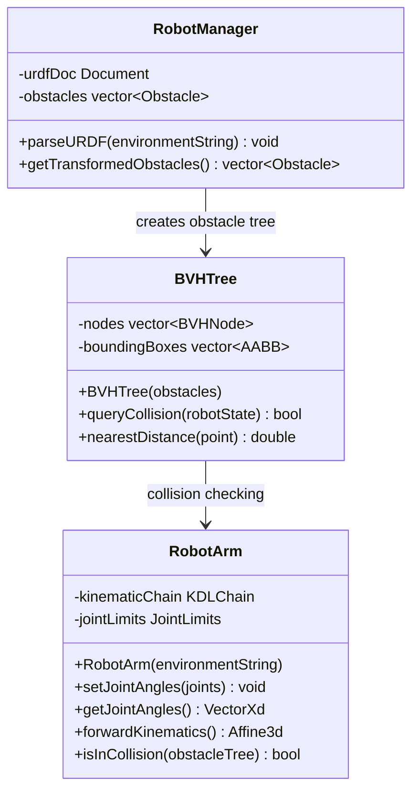
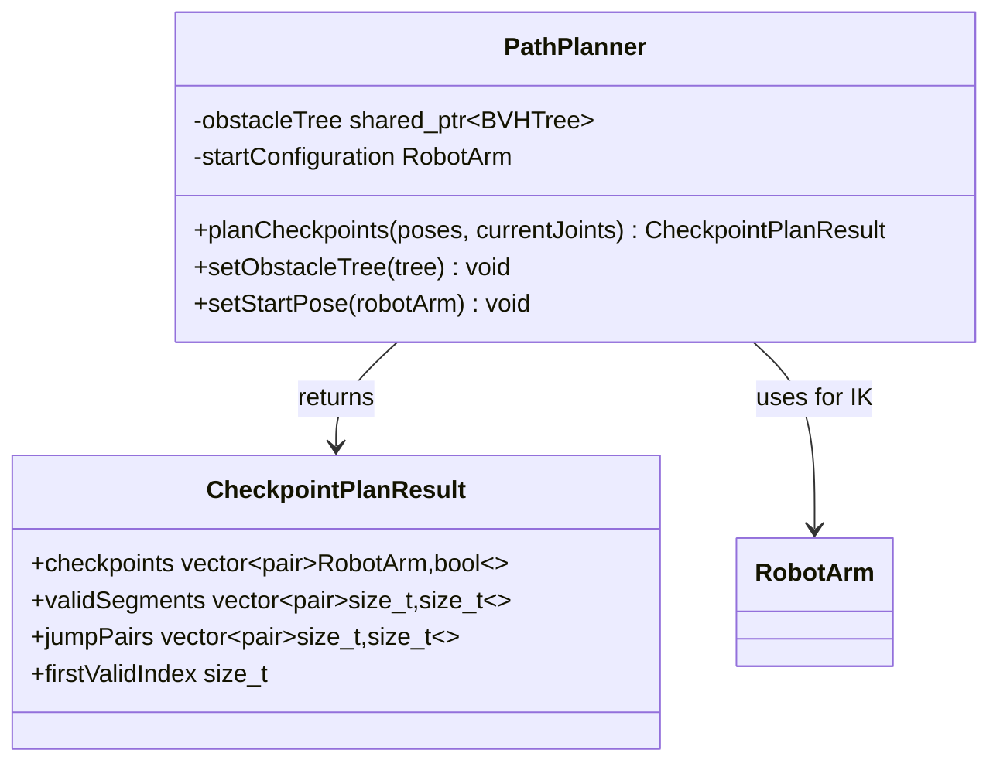
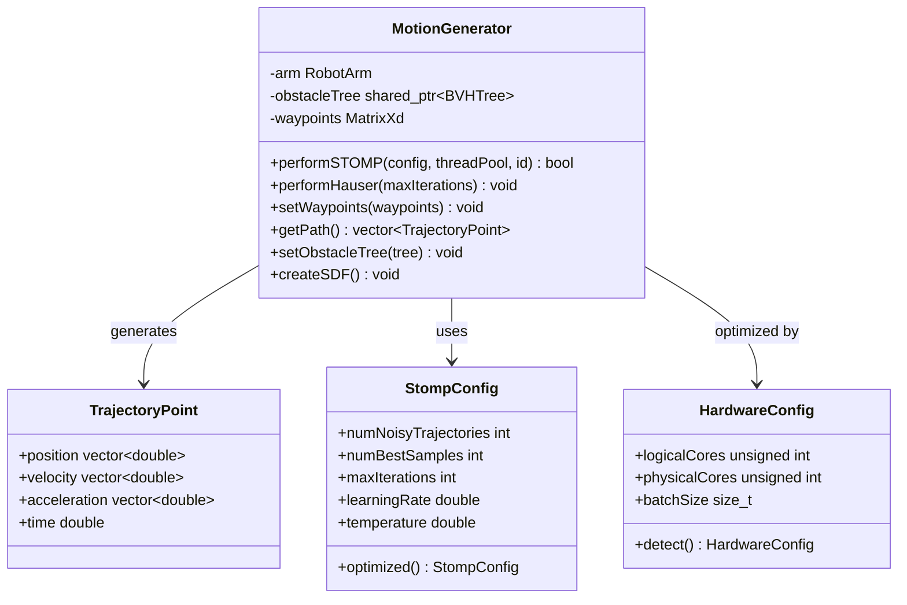
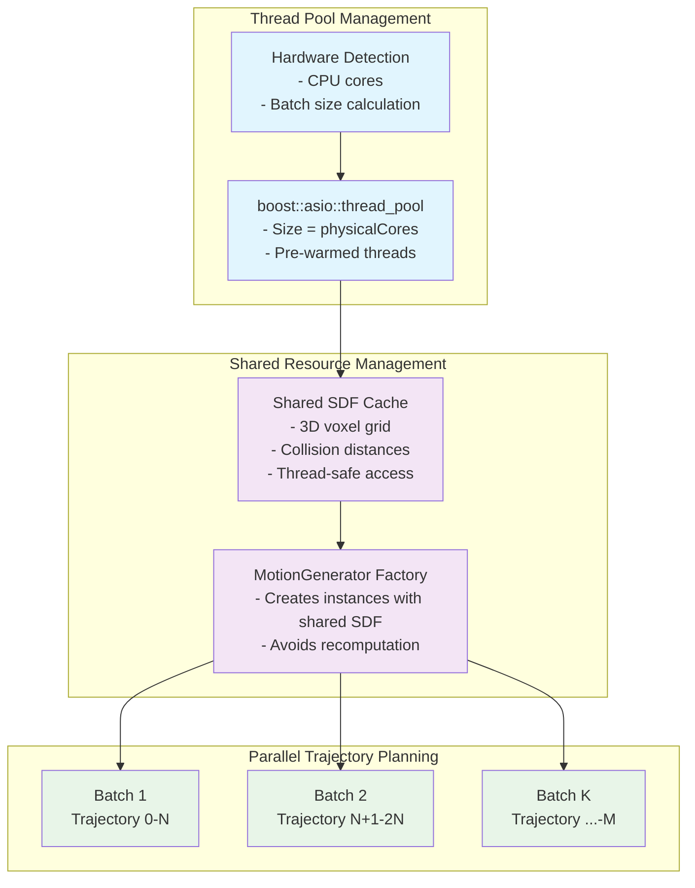
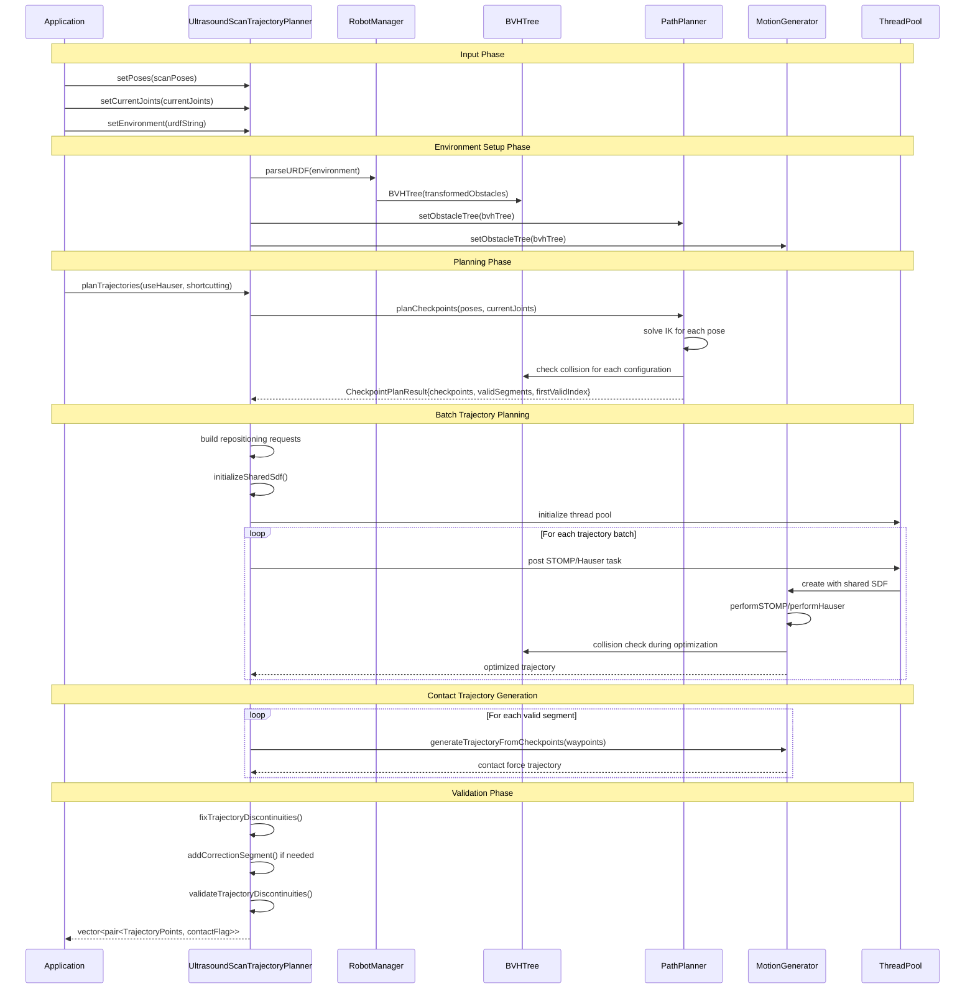
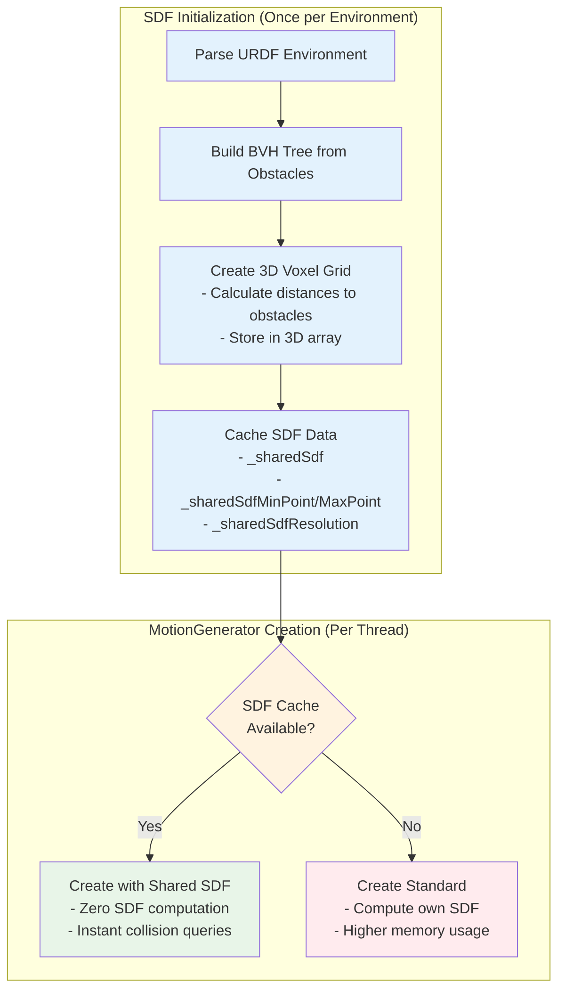
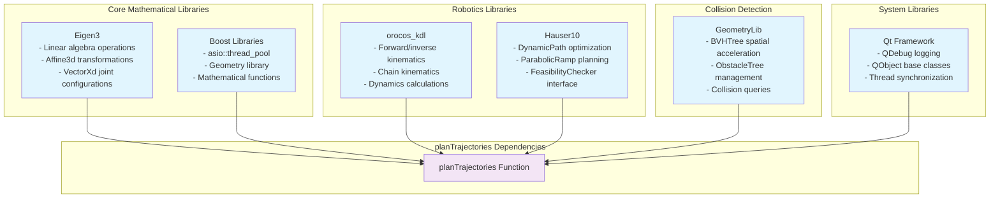

# TrajectoryLib Architecture for planTrajectories Function

This document provides a comprehensive architectural analysis focused specifically on the functionality required by the `UltrasoundScanTrajectoryPlanner::planTrajectories()` method, which serves as the primary entry point for ultrasound scan trajectory planning.

## planTrajectories Function Overview

The `planTrajectories` method is the core orchestration function that transforms a sequence of ultrasound scan poses into executable robot trajectories. It coordinates multiple TrajectoryLib components to generate collision-free, time-optimal paths for both repositioning movements and contact-force scanning operations.

### Core Functionality Requirements

```mermaid
graph TB
    subgraph "Input Processing"
        Poses[Scan Poses<br/>vector&lt;Affine3d&gt;]
        CurrentJoints[Current Joints<br/>VectorXd]
        Environment[URDF Environment<br/>string]
    end
    
    subgraph "planTrajectories Core Flow"
        EnvSetup[Environment Setup<br/>- URDF Parsing<br/>- BVH Tree Construction]
        CheckpointPlan[Checkpoint Planning<br/>- IK Solutions<br/>- Validity Checking<br/>- Segment Grouping]
        BatchPlan[Batch Trajectory Planning<br/>- Repositioning Trajectories<br/>- Multi-threaded STOMP/Hauser]
        ContactGen[Contact Trajectory Generation<br/>- Time-optimal paths<br/>- Through waypoints]
        Validation[Trajectory Validation<br/>- Discontinuity Detection<br/>- Correction Segments]
    end
    
    subgraph "Output Generation"
        Trajectories[Final Trajectories<br/>vector&lt;pair&lt;TrajectoryPoints, bool&gt;&gt;<br/>- Repositioning (false)<br/>- Contact Force (true)]
    end
    
    Poses --> CheckpointPlan
    CurrentJoints --> CheckpointPlan
    Environment --> EnvSetup
    
    EnvSetup --> CheckpointPlan
    CheckpointPlan --> BatchPlan
    BatchPlan --> ContactGen
    ContactGen --> Validation
    Validation --> Trajectories
    
    classDef input fill:#e3f2fd
    classDef core fill:#f3e5f5
    classDef output fill:#e8f5e8
    
    class Poses,CurrentJoints,Environment input
    class EnvSetup,CheckpointPlan,BatchPlan,ContactGen,Validation core  
    class Trajectories output
```

## Required Component Dependencies

### 1. Environment Processing Components



**Usage in planTrajectories**:
```cpp
// Environment setup (lines 61-67 in USTrajectoryPlanner.cpp)
_robotManager.parseURDF(_environment);
_obstacleTree = std::make_shared<BVHTree>(_robotManager.getTransformedObstacles());
_pathPlanner->setObstacleTree(_obstacleTree);
_motionGenerator->setObstacleTree(_obstacleTree);
```

### 2. Checkpoint Planning Components



**Usage in planTrajectories**:
```cpp
// Checkpoint planning (lines 143-147 in USTrajectoryPlanner.cpp)  
auto checkpointResult = _pathPlanner->planCheckpoints(_poses, _currentJoints);
auto &checkpoints = checkpointResult.checkpoints;
auto &validSegments = checkpointResult.validSegments;
size_t firstValidIndex = checkpointResult.firstValidIndex;
```

### 3. Batch Trajectory Planning Components



**Usage in planTrajectories**:
```cpp
// Batch planning (lines 194-202 in USTrajectoryPlanner.cpp)
std::vector<Trajectory> repositioningResults;
if (useHauserForRepositioning) {
    repositioningResults = planTrajectoryBatchHauser(repositioningRequests,
                                                     repositioningDescriptions,
                                                     enableShortcutting);
} else {
    repositioningResults = planTrajectoryBatch(repositioningRequests,
                                               repositioningDescriptions,
                                               enableShortcutting);
}
```

### 4. Multi-threading Architecture



**Usage in planTrajectories**:
```cpp
// Thread pool initialization (lines 324-338 in USTrajectoryPlanner.cpp)
void UltrasoundScanTrajectoryPlanner::initializeThreadPool() {
    if (!_sharedThreadPool) {
        const auto &config = _hardwareConfig;
        size_t optimalThreads = config.physicalCores;
        _sharedThreadPool = std::make_shared<boost::asio::thread_pool>(optimalThreads);
        
        // Pre-warm the thread pool
        for (size_t i = 0; i < optimalThreads; ++i) {
            boost::asio::post(*_sharedThreadPool, []() {
                std::this_thread::sleep_for(std::chrono::microseconds(1));
            });
        }
    }
}
```

## Data Flow Analysis

### Complete planTrajectories Data Flow



### Key Data Structures

#### CheckpointPlanResult Structure
```cpp
struct CheckpointPlanResult {
    // Each checkpoint: (RobotArm configuration, validity flag)
    std::vector<std::pair<RobotArm, bool>> checkpoints;
    
    // Valid segments: (start_index, end_index) pairs for continuous paths
    std::vector<std::pair<size_t, size_t>> validSegments;
    
    // Jump pairs: (from_index, to_index) for large discontinuities  
    std::vector<std::pair<size_t, size_t>> jumpPairs;
    
    // Index of first valid checkpoint to start trajectory from
    size_t firstValidIndex;
};
```

#### TrajectoryPoint Structure
```cpp
struct TrajectoryPoint {
    std::vector<double> position;     // Joint angles [rad]
    std::vector<double> velocity;     // Joint velocities [rad/s]  
    std::vector<double> acceleration; // Joint accelerations [rad/s²]
    double time;                      // Time stamp [s]
};
```

#### Final Trajectory Output
```cpp
// Pair of (trajectory_points, is_contact_force)
std::vector<std::pair<std::vector<TrajectoryPoint>, bool>> trajectories;

// Usage:
// - false: Repositioning movement (free motion between poses)
// - true:  Contact force trajectory (scanning with surface contact)
```

## Algorithm Integration

### STOMP Optimization Pipeline

```mermaid
graph TB
    subgraph "STOMP Algorithm Flow"
        Init[Initialize Trajectory<br/>- Straight line in joint space<br/>- N waypoints with dt spacing]
        
        subgraph "Optimization Loop (maxIterations)"
            Sample[Generate Noisy Samples<br/>- numNoisyTrajectories<br/>- Gaussian noise injection]
            Evaluate[Evaluate Cost Function<br/>- Collision cost (SDF)<br/>- Smoothness cost<br/>- Constraint violations]
            Select[Select Best Samples<br/>- numBestSamples<br/>- Probability weighting]
            Update[Update Trajectory<br/>- Weighted combination<br/>- Learning rate scaling]
        end
        
        Converge[Convergence Check<br/>- Cost improvement<br/>- Maximum iterations<br/>- Early stopping]
        Output[Final Trajectory<br/>- Collision-free<br/>- Smooth acceleration]
    end
    
    Init --> Sample
    Sample --> Evaluate
    Evaluate --> Select
    Select --> Update
    Update --> Converge
    Converge -->|Not converged| Sample
    Converge -->|Converged| Output
    
    classDef init fill:#e3f2fd
    classDef optimization fill:#f3e5f5
    classDef output fill:#e8f5e8
    
    class Init init
    class Sample,Evaluate,Select,Update,Converge optimization
    class Output output
```

**STOMP Configuration for planTrajectories**:
```cpp
struct StompConfig {
    int numNoisyTrajectories = 12;    // Parallel noise samples per iteration
    int numBestSamples = 6;           // Best samples for weighted update
    int maxIterations = 250;          // Maximum optimization iterations
    int N = 75;                       // Trajectory discretization points
    double dt = 0.1;                  // Time step between points [s]
    double learningRate = 0.1;        // Update step size
    double temperature = 15.9079;     // Sample weighting temperature
    
    // Factory methods
    static StompConfig optimized();   // Research-optimized parameters
    static StompConfig fast();        // Faster execution, lower quality
    static StompConfig quality();     // Higher quality, slower execution
};
```

### RRT+Hauser Pipeline

```mermaid
graph TB
    subgraph "RRT+Hauser Algorithm Flow"
        RRTInit[RRT Connect Setup<br/>- Start/goal configurations<br/>- Step size, bias parameters]
        
        subgraph "RRT Connect Phase"
            Sample[Sample Random Configuration<br/>- Uniform sampling in C-space<br/>- Goal bias probability]
            Extend[Extend Trees<br/>- Bidirectional growth<br/>- Collision checking]
            Connect[Connect Trees<br/>- Bridge start/goal trees<br/>- Validate connection]
        end
        
        Shortcut[Path Shortcutting<br/>- Remove redundant waypoints<br/>- Collision-check shortcuts]
        
        subgraph "Hauser Optimization Phase"
            HauserInit[Initialize DynamicPath<br/>- RRT waypoints<br/>- Velocity/acceleration limits]
            TimeOpt[Time-Optimal Planning<br/>- Parabolic ramps<br/>- Physics constraints]
            Feasibility[Feasibility Checking<br/>- ArmFeasibilityChecker<br/>- Collision validation]
        end
        
        HauserOutput[Physics-Aware Trajectory<br/>- Time-optimal<br/>- Dynamics constraints]
    end
    
    RRTInit --> Sample
    Sample --> Extend
    Extend --> Connect
    Connect -->|No path| Sample
    Connect -->|Path found| Shortcut
    Shortcut --> HauserInit
    HauserInit --> TimeOpt
    TimeOpt --> Feasibility
    Feasibility --> HauserOutput
    
    classDef rrt fill:#e1f5fe
    classDef hauser fill:#f3e5f5
    classDef output fill:#e8f5e8
    
    class RRTInit,Sample,Extend,Connect,Shortcut rrt
    class HauserInit,TimeOpt,Feasibility hauser
    class HauserOutput output
```



## Performance Optimizations

### SDF Caching Strategy



### Batch Processing Optimization

**Hardware-Aware Batching**:
```cpp
struct HardwareConfig {
    unsigned int logicalCores;   // std::thread::hardware_concurrency()
    unsigned int physicalCores;  // Physical CPU cores
    size_t batchSize;           // Optimal batch size = physicalCores / 2
    
    static HardwareConfig detect() {
        HardwareConfig config;
        config.logicalCores = std::thread::hardware_concurrency();
        config.physicalCores = std::max(1u, config.logicalCores);
        config.batchSize = std::max(1UL, static_cast<size_t>(config.physicalCores) / 2);
        return config;
    }
};
```

**Memory-Efficient Processing**:
- Process trajectories in hardware-optimized batches
- Share SDF data across all threads to minimize memory footprint
- Pre-warm thread pool to eliminate task dispatch overhead
- Use atomic counters for lock-free progress tracking

## Trajectory Validation and Correction

### Discontinuity Detection

```mermaid
graph TB
    subgraph "Trajectory Validation Pipeline"
        Input[Input: Sequence of Trajectory Segments]
        
        subgraph "Discontinuity Analysis"
            SegmentCheck[Check Adjacent Segments<br/>- Compare end/start positions<br/>- Threshold: 0.01 rad (~0.57°)]
            JointAnalysis[Joint-by-Joint Analysis<br/>- Find maximum joint difference<br/>- Identify problematic joints]
            ClassifyDisc[Classify Discontinuity<br/>- Minor: < 0.1 rad (5.7°)<br/>- Major: ≥ 0.1 rad]
        end
        
        subgraph "Correction Generation"
            CorrectionPlan[Plan Correction Segment<br/>- Time-optimal trajectory<br/>- From segment end to next start]
            Append[Append to Current Segment<br/>- Maintain timing continuity<br/>- Preserve next segment start time]
        end
        
        Validate[Final Validation<br/>- Re-check all segments<br/>- Confirm continuity]
    end
    
    Input --> SegmentCheck
    SegmentCheck --> JointAnalysis
    JointAnalysis --> ClassifyDisc
    ClassifyDisc -->|Discontinuity found| CorrectionPlan
    ClassifyDisc -->|No issues| Validate
    CorrectionPlan --> Append
    Append --> Validate
    
    classDef input fill:#e3f2fd
    classDef analysis fill:#f3e5f5
    classDef correction fill:#fff3e0
    classDef validation fill:#e8f5e8
    
    class Input input
    class SegmentCheck,JointAnalysis,ClassifyDisc analysis
    class CorrectionPlan,Append correction
    class Validate validation
```

### Correction Segment Generation
```cpp
bool addCorrectionSegment(
    size_t segmentIndex,
    const TrajectoryPoint& fromPoint,  // End of current segment
    const TrajectoryPoint& toPoint     // Start of next segment
) {
    // Create MotionGenerator with shared SDF for efficiency
    auto motionGenerator = createMotionGeneratorWithSharedSdf(*_arm);
    
    // Generate time-optimal correction trajectory
    auto correctionTrajectory = motionGenerator->computeTimeOptimalSegment(
        fromPoint,   // Start at current segment end
        toPoint,     // End at next segment start
        fromPoint.time  // Continue from current time
    );
    
    // Append correction points to current segment (skip first to avoid duplication)
    auto& currentSegment = _trajectories[segmentIndex].first;
    double currentSegmentEndTime = currentSegment.back().time;
    
    for (size_t i = 1; i < correctionTrajectory.size(); ++i) {
        auto point = correctionTrajectory[i];
        point.time += currentSegmentEndTime;  // Adjust timing
        currentSegment.push_back(point);
    }
    
    return true;
}
```

## System Integration Requirements

### Required External Libraries



### Memory and Performance Requirements

**Memory Usage**:
- **SDF Cache**: ~10-50 MB for typical workspace (depends on resolution)
- **BVH Tree**: ~1-10 MB for complex environments
- **Trajectory Storage**: ~100 KB per trajectory (75 points × 7 joints × 8 bytes)
- **Thread Pool**: Minimal overhead (~1 MB per thread)

**Performance Characteristics**:
- **Checkpoint Planning**: 10-100 ms (depends on number of poses)
- **STOMP Optimization**: 1-10 seconds per trajectory (depends on complexity)
- **RRT+Hauser**: 0.5-5 seconds per trajectory (faster but less optimal)
- **Batch Processing**: Linear speedup with available CPU cores

**Scalability**:
- **Pose Count**: Tested up to 50+ scan poses
- **Parallel Trajectories**: Up to CPU core count (typically 8-16)
- **Environment Complexity**: Handles 1000+ obstacle primitives
- **Trajectory Length**: Up to 1000+ waypoints per trajectory

This architecture enables `planTrajectories` to efficiently coordinate all necessary components for ultrasound scan trajectory planning, from environment setup through final trajectory validation, while maintaining real-time performance and safety requirements.