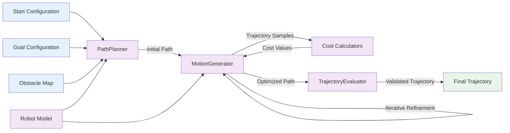

# TrajectoryLib Architecture Diagram

## Overview

This document presents the comprehensive architecture diagram for the TrajectoryLib library, which is the core trajectory planning and optimization component of the Robotic Ultrasound System (RUS).

## System Architecture

```mermaid
graph TB
    %% External Dependencies
    subgraph "External Libraries"
        Qt[Qt Framework<br/>Widgets, OpenGL, 3D]
        Eigen[Eigen3<br/>Linear Algebra]
        Boost[Boost<br/>Math, System]
        KDL[orocos_kdl<br/>Kinematics]
        GeomLib[GeometryLib<br/>BVH, Obstacles]
        Hauser[Hauser10<br/>DynamicPath]
    end

    %% TrajectoryLib Main Components
    subgraph "TrajectoryLib"
        %% Core Module
        subgraph "Core Module"
            Util[Util.cpp<br/>General utilities]
            Spline[spline.h<br/>Spline interpolation]
            SA[SimulatedAnnealing<br/>Optimization algorithm]
        end

        %% Motion Module  
        subgraph "Motion Module"
            MG[MotionGenerator<br/>STOMP optimization<br/>2,698 lines]
            Task[task.h<br/>Task definitions]
            CC[Cost Calculators<br/>6 different functions]
        end

        %% Planning Module
        subgraph "Planning Module"
            PP[PathPlanner<br/>Main planning interface]
            RRT[RRT.h<br/>Rapidly-exploring<br/>Random Tree]
            RRTStar[RRTStar.h<br/>Optimal RRT variant]
        end

        %% Robot Module
        subgraph "Robot Module"
            Robot[Robot.h/.cpp<br/>Base robot class]
            RobotArm[RobotArm<br/>Arm kinematics]
            RobotMgr[RobotManager<br/>Robot coordination]
            FrankaIK[franka_ik_He<br/>Franka robot IK]
        end

        %% Utils Module
        subgraph "Utils Module"
            TrajEval[TrajectoryEvaluator<br/>Analysis & metrics]
        end

        %% Visualization Module
        subgraph "Visualization Module"
            TBC[trackballcameracontroller<br/>Camera control]
        end

        %% Logging
        Logger[Logger.h<br/>Custom logging system]
        Logging[Logging.h<br/>Log utilities]
    end

    %% External Applications
    subgraph "Dependent Applications"
        USLib[USLib<br/>Medical ultrasound<br/>trajectory planning]
        ParamTune[Parameter Tuning<br/>Applications]
        GUI[PathPlanner GUI<br/>Visualization]
        Eval[Evaluation Tools<br/>Analysis & comparison]
    end

    %% Dependencies (External to TrajectoryLib)
    Qt --> MG
    Qt --> PP
    Qt --> TBC
    Eigen --> MG
    Eigen --> Robot
    Eigen --> PP
    Boost --> MG
    KDL --> Robot
    GeomLib --> MG
    GeomLib --> PP
    Hauser --> MG

    %% Internal Dependencies
    Util --> MG
    Spline --> MG
    Robot --> MG
    Robot --> PP
    RobotArm --> Robot
    RobotMgr --> RobotArm
    FrankaIK --> RobotArm
    TrajEval --> MG
    Logger --> MG
    Logger --> PP

    %% Planning Dependencies
    RRT --> PP
    RRTStar --> PP
    
    %% Usage Dependencies
    USLib --> MG
    USLib --> PP
    ParamTune --> MG
    GUI --> PP
    GUI --> TBC
    Eval --> TrajEval

    %% Styling
    classDef coreModule fill:#e1f5fe
    classDef motionModule fill:#f3e5f5
    classDef planningModule fill:#e8f5e8
    classDef robotModule fill:#fff3e0
    classDef utilsModule fill:#fce4ec
    classDef vizModule fill:#f1f8e9
    classDef external fill:#ffebee
    classDef apps fill:#e0f2f1

    class Util,Spline,SA coreModule
    class MG,Task,CC motionModule
    class PP,RRT,RRTStar planningModule
    class Robot,RobotArm,RobotMgr,FrankaIK robotModule
    class TrajEval utilsModule
    class TBC vizModule
    class Qt,Eigen,Boost,KDL,GeomLib,Hauser external
    class USLib,ParamTune,GUI,Eval apps
```

## Module Descriptions

### Core Module
- **Util.cpp**: General utility functions and helper methods
- **spline.h**: Spline interpolation algorithms for smooth trajectory generation
- **SimulatedAnnealing**: Alternative optimization algorithm implementation

### Motion Module
- **MotionGenerator**: The heart of TrajectoryLib - implements STOMP (Stochastic Trajectory Optimization for Motion Planning) algorithm with 2,698 lines of code
- **task.h**: Task definition structures and interfaces
- **Cost Calculators**: Six different cost functions for trajectory optimization including collision, smoothness, and constraint costs

### Planning Module  
- **PathPlanner**: Main path planning interface that coordinates different planning algorithms
- **RRT.h**: Rapidly-exploring Random Tree algorithm for path planning
- **RRTStar.h**: Optimal variant of RRT for improved path quality

### Robot Module
- **Robot**: Base robot class with joint definitions and kinematic properties
- **RobotArm**: Specialized robotic arm implementation with forward/inverse kinematics
- **RobotManager**: Coordinates multiple robots and manages robot state
- **franka_ik_He**: Inverse kinematics solver specifically for Franka robots

### Utils Module
- **TrajectoryEvaluator**: Comprehensive trajectory analysis and evaluation metrics

### Visualization Module
- **trackballcameracontroller**: 3D camera control for trajectory visualization

## Data Flow Architecture

## Key Interfaces and APIs

### Primary Public Interfaces

1. **MotionGenerator API**
   - `generateTrajectory()`: Main STOMP optimization entry point
   - `setCostWeights()`: Configure cost function weights
   - `setConstraints()`: Define trajectory constraints

2. **PathPlanner API**
   - `planPath()`: RRT/RRT* path planning
   - `setStartGoal()`: Configure start and goal states
   - `addObstacles()`: Register collision obstacles

3. **Robot API**
   - `forwardKinematics()`: Joint to Cartesian mapping
   - `inverseKinematics()`: Cartesian to joint mapping
   - `checkCollision()`: Collision detection

4. **TrajectoryEvaluator API**
   - `evaluateTrajectory()`: Comprehensive trajectory analysis
   - `computeMetrics()`: Performance and quality metrics

### External Integration Points

- **USLib Integration**: Medical ultrasound-specific trajectory planning
- **GUI Integration**: Qt-based visualization and user interface
- **Parameter Tuning**: Configuration and optimization interfaces

## Performance Characteristics

- **Multi-threaded STOMP**: Parallel trajectory optimization using boost::asio thread pools
- **Spatial Indexing**: BVH trees for efficient collision detection
- **Memory Management**: Eigen-based linear algebra with optimized memory layouts
- **Real-time Constraints**: Designed for medical-grade timing requirements

## Safety and Reliability Features

- **Collision Avoidance**: Multi-level collision detection with BVH spatial indexing
- **Joint Limit Enforcement**: Hardware constraint validation
- **Trajectory Validation**: Comprehensive quality checks before execution
- **Graceful Degradation**: Fallback algorithms when optimization fails
- **Exception Handling**: Robust error handling with custom exception types

## Dependencies Summary

### Critical Dependencies
- **Eigen3**: Essential for all linear algebra operations
- **GeometryLib**: Required for collision detection and spatial reasoning
- **orocos_kdl**: Kinematics and dynamics computations

### GUI Dependencies  
- **Qt Framework**: Visualization, OpenGL rendering, and user interface

### Performance Dependencies
- **Boost**: Mathematical functions, threading, and system utilities
- **Hauser10**: Dynamic path representation and manipulation

## Extension Points

The architecture provides several extension points for future development:

1. **New Planning Algorithms**: Plugin architecture in PathPlanner
2. **Custom Cost Functions**: Extensible cost calculator framework
3. **Robot Models**: Modular robot definition system
4. **Visualization Plugins**: Qt-based rendering extensions

## Conclusion

The TrajectoryLib architecture demonstrates a sophisticated, modular design that separates concerns while maintaining high performance and safety standards. The combination of STOMP optimization, RRT path planning, and comprehensive robot modeling provides a robust foundation for medical robotics applications.