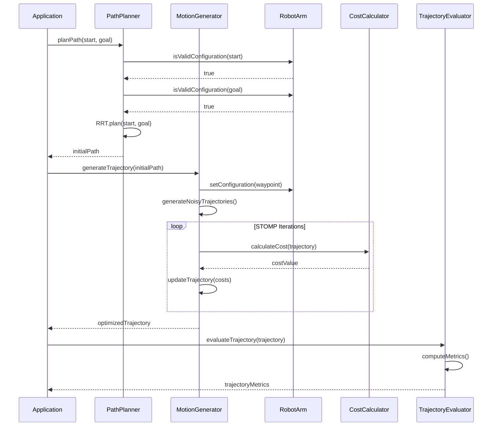
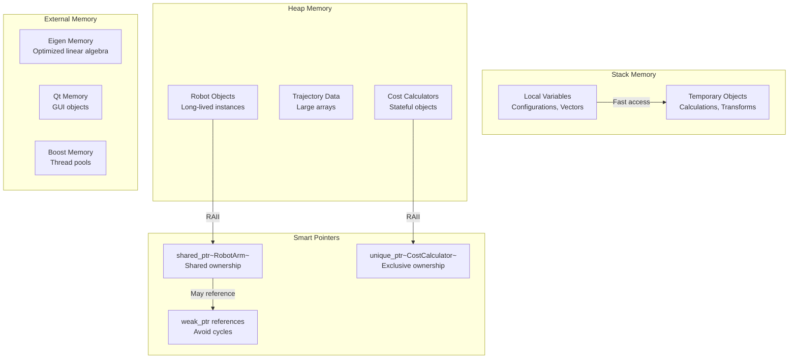
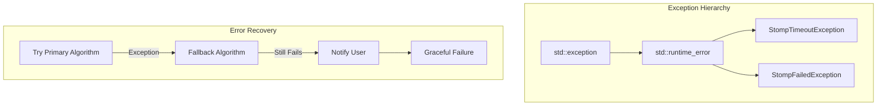

# TrajectoryLib Detailed Class Architecture

## Detailed Class Diagram

```mermaid
classDiagram
    %% Core Classes
    class Util {
        +static double distance()
        +static Vector3d normalize()
        +static Matrix4d transformation()
        +static bool isValidConfiguration()
    }

    class SimulatedAnnealing {
        -double temperature
        -double coolingRate
        -int maxIterations
        +optimize(initialSolution) Solution
        +setParameters(temp, rate, iterations)
        -acceptSolution(oldCost, newCost) bool
        -cool() void
    }

    %% Motion Classes
    class MotionGenerator {
        -RobotArm* robot
        -BVHTree* obstacleTree
        -vector~CostCalculator*~ costCalculators
        -ThreadPool threadPool
        -StompParameters params
        +generateTrajectory(start, goal) Trajectory
        +setRobot(RobotArm* robot)
        +addCostCalculator(CostCalculator* calc)
        +setStompParameters(params)
        -optimizeWithStomp() Trajectory
        -generateNoisyTrajectories() vector~Trajectory~
        -evaluateCosts(trajectories) vector~double~
        -updateTrajectory(costs) void
    }

    class Task {
        <<interface>>
        +execute() bool
        +validate() bool
        +getDescription() string
    }

    class CostCalculator {
        <<abstract>>
        +calculateCost(trajectory) double
        +getWeight() double
        +setWeight(weight)
    }

    class CollisionCostCalculator {
        -BVHTree* obstacles
        +calculateCost(trajectory) double
        -checkCollision(state) bool
    }

    class SmoothnessCostCalculator {
        +calculateCost(trajectory) double
        -computeJerk(trajectory) double
    }

    %% Planning Classes
    class PathPlanner {
        -RobotArm* robot
        -BVHTree* obstacles
        -PlanningAlgorithm* algorithm
        +planPath(start, goal) Path
        +setAlgorithm(algorithm)
        +addObstacle(obstacle)
        +setRobot(robot)
        -validatePath(path) bool
    }

    class RRT {
        -double stepSize
        -int maxIterations
        -double goalBias
        +plan(start, goal) Path
        +setStepSize(size)
        +setGoalBias(bias)
        -extend(tree, sample) Node*
        -steer(from, to) Configuration
        -isCollisionFree(config) bool
    }

    class RRTStar {
        -double gamma
        -double eta
        +plan(start, goal) Path
        -rewire(tree, newNode) void
        -chooseBestParent(newNode, nearNodes) Node*
        -cost(node) double
    }

    class PathNode {
        -Configuration config
        -PathNode* parent
        -vector~PathNode*~ children
        -double cost
        +getConfiguration() Configuration
        +getParent() PathNode*
        +addChild(child)
        +getCost() double
    }

    %% Robot Classes
    class Joint {
        +string name
        +Vector3d origin
        +Vector3d axis
        +double minRange
        +double maxRange
        +double current
        +isInRange(value) bool
        +setCurrentValue(value)
    }

    class Robot {
        #vector~Joint~ joints
        #string name
        #int dof
        +forwardKinematics(config) Transform
        +getJointCount() int
        +getJoint(index) Joint&
        +setConfiguration(config)
        +isValidConfiguration(config) bool
    }

    class RobotArm {
        -KDL::Chain kinematicChain
        -KDL::ChainFkSolverPos_recursive* fkSolver
        -KDL::ChainIkSolverVel_pinv* ikSolver
        +forwardKinematics(jointAngles) Transform
        +inverseKinematics(target) JointAngles
        +getJacobian(config) Matrix
        +checkJointLimits(config) bool
        -initializeKDL()
    }

    class RobotManager {
        -vector~RobotArm*~ robots
        -RobotArm* activeRobot
        +addRobot(robot)
        +setActiveRobot(index)
        +getActiveRobot() RobotArm*
        +getRobotCount() int
        +executeTrajectory(trajectory) bool
    }

    class FrankaIKSolver {
        -static const int DOF
        -Matrix4d toolTransform
        +solveIK(target, seed) JointAngles
        +isReachable(target) bool
        -computeAnalyticalSolution() vector~JointAngles~
        -selectBestSolution(solutions) JointAngles
    }

    %% Utils Classes
    class TrajectoryEvaluator {
        +evaluateTrajectory(trajectory) TrajectoryMetrics
        +computeSmoothness(trajectory) double
        +computeLength(trajectory) double
        +computeExecutionTime(trajectory) double
        +checkConstraints(trajectory) bool
        +generateReport(trajectory) string
    }

    class TrajectoryMetrics {
        +double smoothness
        +double length
        +double executionTime
        +bool constraintsSatisfied
        +vector~double~ jointVelocities
        +vector~double~ jointAccelerations
    }

    %% Visualization Classes
    class TrackballCameraController {
        -Vector3d position
        -Vector3d target
        -Vector3d up
        -double distance
        +rotate(deltaX, deltaY)
        +zoom(delta)
        +pan(deltaX, deltaY)
        +getViewMatrix() Matrix4d
        +reset()
    }

    %% Exception Classes
    class StompTimeoutException {
        +StompTimeoutException(message)
    }

    class StompFailedException {
        +StompFailedException(message)
    }

    %% Data Classes
    class Trajectory {
        -vector~Configuration~ waypoints
        -vector~double~ timestamps
        -bool isValid
        +addWaypoint(config, time)
        +getWaypoint(index) Configuration
        +getSize() int
        +interpolate(time) Configuration
        +validate() bool
    }

    class Configuration {
        -VectorXd jointAngles
        -Transform endEffectorPose
        +getJointAngle(index) double
        +setJointAngle(index, value)
        +getEndEffectorPose() Transform
        +isValid() bool
    }

    %% Relationships
    
    %% Inheritance
    Robot <|-- RobotArm
    CostCalculator <|-- CollisionCostCalculator
    CostCalculator <|-- SmoothnessCostCalculator
    RRT <|-- RRTStar
    
    %% Composition
    MotionGenerator *-- RobotArm
    MotionGenerator *-- CostCalculator
    PathPlanner *-- RobotArm
    PathPlanner *-- RRT
    RobotArm *-- Joint
    RobotManager *-- RobotArm
    Trajectory *-- Configuration
    PathNode *-- Configuration
    
    %% Aggregation  
    RobotArm o-- FrankaIKSolver
    TrajectoryEvaluator o-- TrajectoryMetrics
    
    %% Dependencies
    MotionGenerator ..> Trajectory
    MotionGenerator ..> StompTimeoutException
    MotionGenerator ..> StompFailedException
    PathPlanner ..> PathNode
    PathPlanner ..> Trajectory
    RRT ..> PathNode
    TrajectoryEvaluator ..> Trajectory
    
    %% External Dependencies (shown as interfaces)
    class BVHTree {
        <<external>>
        +query(point) vector~Obstacle~
        +insert(obstacle)
    }
    
    class Eigen_VectorXd {
        <<external>>
        +size() int
        +operator[](index) double
    }
    
    class Qt3D_Entity {
        <<external>>
        +addComponent(component)
    }
    
    MotionGenerator ..> BVHTree
    Configuration ..> Eigen_VectorXd
    TrackballCameraController ..> Qt3D_Entity
```

## Method Interaction Sequence Diagram

## Key Design Patterns Used

### 1. Strategy Pattern
- **CostCalculator**: Multiple cost calculation strategies
- **Planning Algorithms**: RRT, RRT*, future algorithms

### 2. Template Method Pattern
- **Robot**: Base class with common kinematics template
- **PathPlanner**: Common planning workflow with algorithm-specific steps

### 3. Observer Pattern
- **Logging**: Components notify loggers of events
- **Progress Tracking**: STOMP iterations report progress

### 4. Factory Pattern
- **Robot Creation**: Different robot types (Franka, UR, etc.)
- **Cost Calculator Factory**: Different cost function types

### 5. Composite Pattern
- **RobotManager**: Manages collection of robots
- **Trajectory**: Composed of multiple waypoints

## Memory Management Strategy

## Thread Safety Considerations

### Thread-Safe Components
- **MotionGenerator**: Uses thread pool for parallel STOMP
- **PathPlanner**: Stateless algorithms (RRT/RRT*)
- **TrajectoryEvaluator**: Read-only operations

### Thread-Unsafe Components (Require External Synchronization)
- **Robot State**: Joint positions and velocities
- **Cost Calculator State**: Mutable configuration
- **Logging**: Shared log buffers

### Synchronization Mechanisms
- **Mutex**: Protecting robot state modifications
- **Atomic**: Performance counters and flags
- **Thread Local**: Random number generators in RRT

## Performance Optimization Features

1. **SIMD Operations**: Eigen vectorization for linear algebra
2. **Memory Pools**: Pre-allocated trajectory buffers
3. **Spatial Indexing**: BVH trees for collision queries
4. **Parallel Processing**: Multi-threaded STOMP optimization
5. **Cache Optimization**: Data structure layout for cache locality

## Error Handling Architecture

This detailed architecture provides a comprehensive view of the TrajectoryLib implementation, showing the intricate relationships between classes, the sophisticated design patterns employed, and the engineering considerations for performance, safety, and maintainability in a medical robotics context.