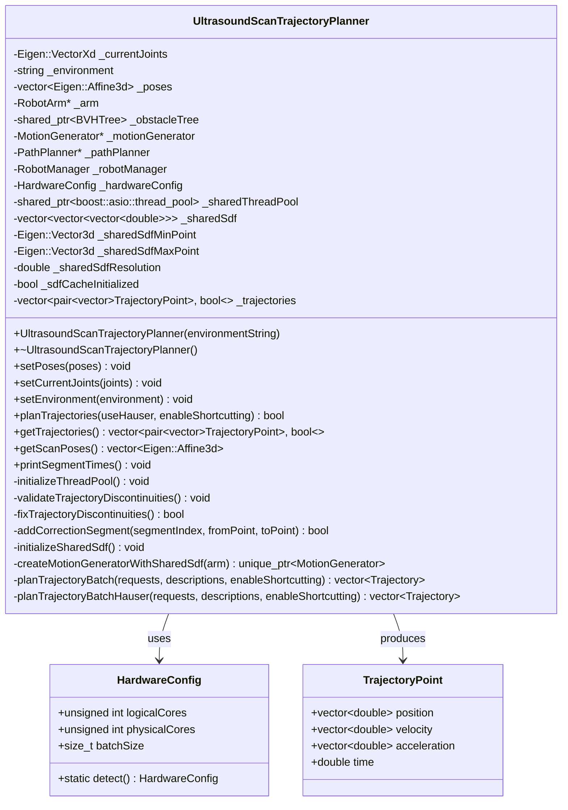
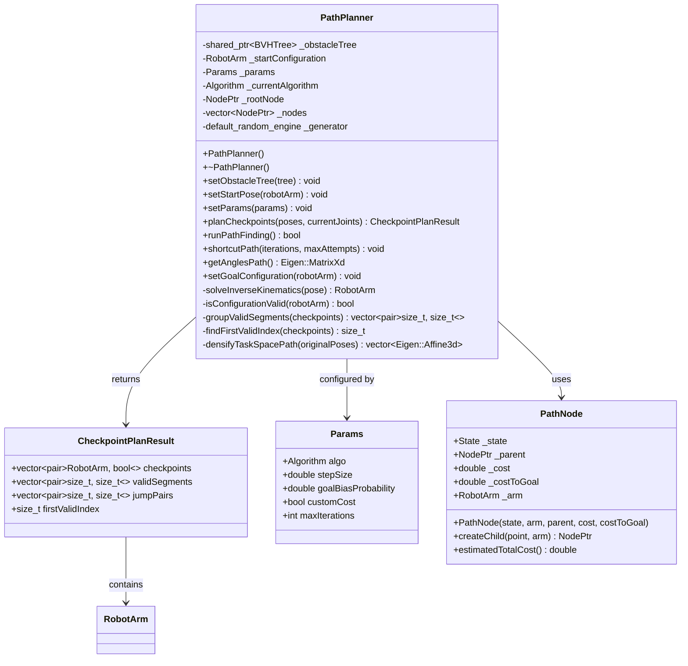
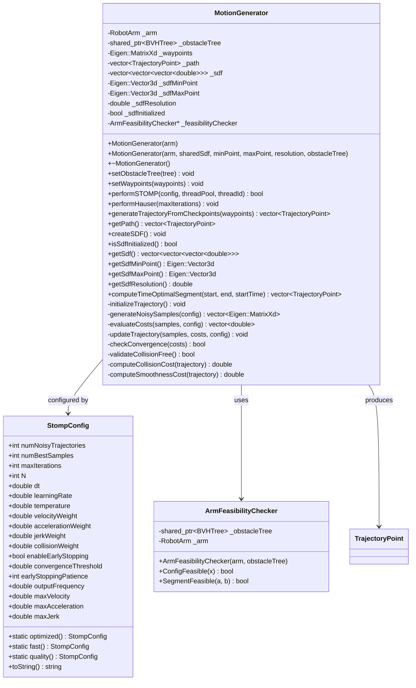
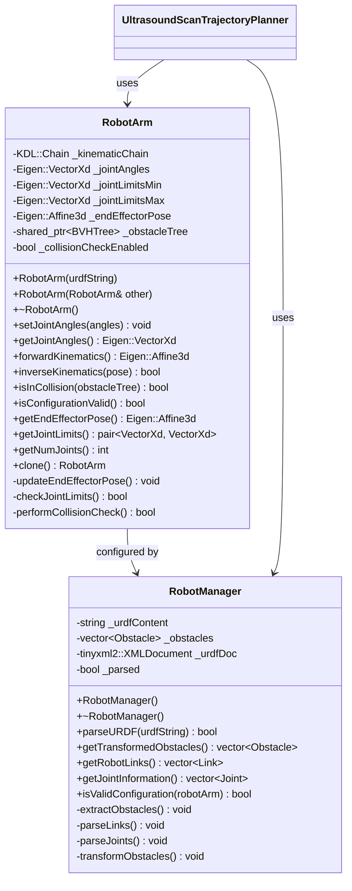
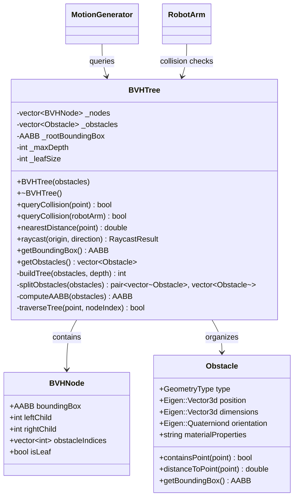
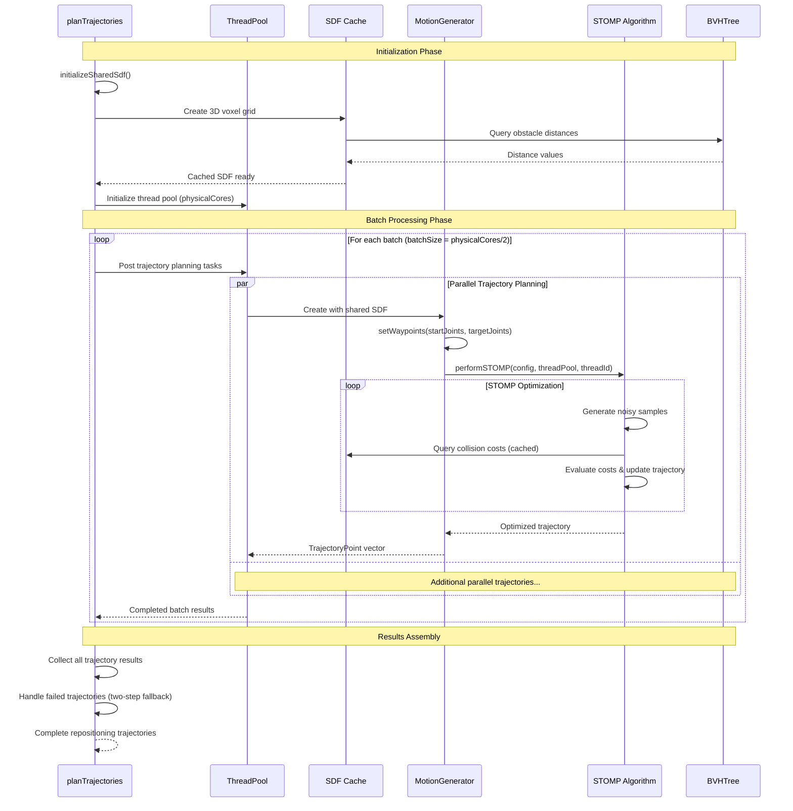
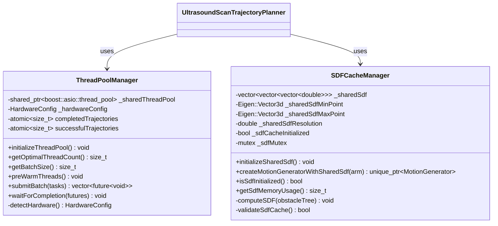
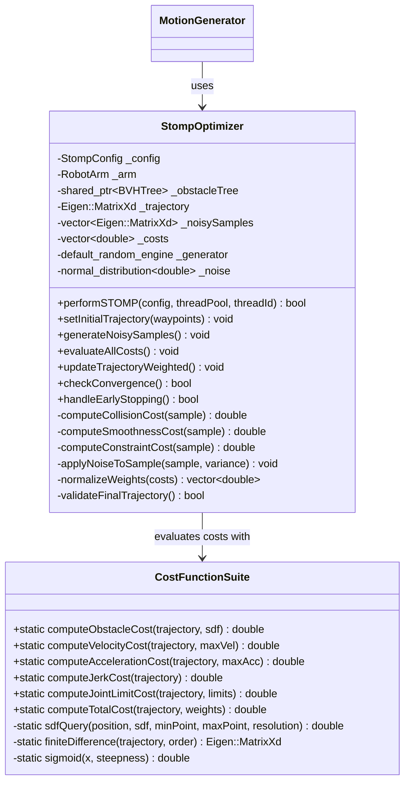
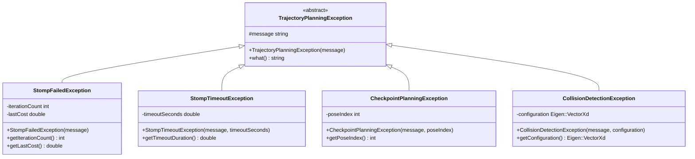
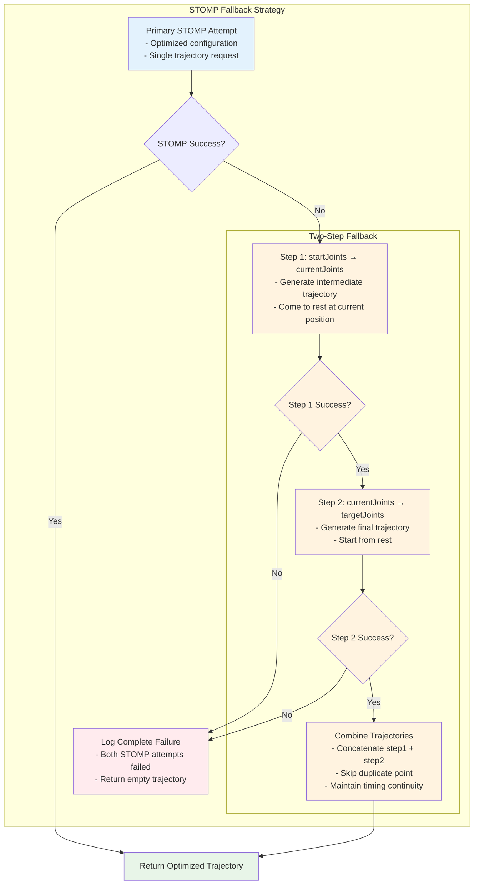

# TrajectoryLib planTrajectories Implementation Details

This document provides detailed class diagrams and implementation analysis specifically focused on the components used by the `UltrasoundScanTrajectoryPlanner::planTrajectories()` method.

## Core Implementation Classes

### 1. UltrasoundScanTrajectoryPlanner Class Detail



### 2. PathPlanner Component



### 3. MotionGenerator Component



### 4. Robot Component Hierarchy



### 5. Collision Detection System



## Data Flow Implementation

### 1. planTrajectories Method Flow

```mermaid
graph TD
    subgraph "Method Entry"
        Validate[Validate Input Data<br/>- Environment not empty<br/>- Current joints = 7 DOF<br/>- Poses not empty]
        ClearTraj[Clear Previous Trajectories<br/>_trajectories.clear()]
    end
    
    subgraph "Single Pose Handling" 
        SingleCheck{poses.size() == 1?}
        SinglePlan[Plan Direct Movement<br/>- planCheckpoints(poses, currentJoints)<br/>- Use first valid checkpoint<br/>- Single trajectory request]
        SingleResult[Store Single Trajectory<br/>- contactFlag = false<br/>- Return early]
    end
    
    subgraph "Multi-Pose Processing"
        MultiPlan[Plan All Checkpoints<br/>- planCheckpoints(poses, currentJoints)<br/>- Extract checkpoints & validSegments<br/>- Identify firstValidIndex]
        BuildRequests[Build Repositioning Requests<br/>- currentJoints → firstValidCheckpoint<br/>- Inter-segment transitions<br/>- Store descriptions for logging]
    end
    
    subgraph "Batch Processing"
        ChooseAlg{useHauserForRepositioning?}
        BatchSTOMP[planTrajectoryBatch<br/>- STOMP optimization<br/>- Parallel processing<br/>- Shared SDF cache]
        BatchHauser[planTrajectoryBatchHauser<br/>- RRT Connect + Hauser<br/>- Physics-aware optimization<br/>- Parallel processing]
    end
    
    subgraph "Trajectory Assembly"
        AddInitial[Add Initial Repositioning<br/>- currentJoints → firstValidCheckpoint<br/>- contactFlag = false]
        
        loop ContactSegments[For Each Valid Segment]
            CheckSingle{start == end?}
            SinglePoint[Create Single Point<br/>- Zero velocity/acceleration<br/>- contactFlag = true]
            MultiPoint[Generate Contact Trajectory<br/>- generateTrajectoryFromCheckpoints<br/>- Time-optimal through waypoints<br/>- contactFlag = true]
            AddInter[Add Inter-segment Repositioning<br/>- If not last segment<br/>- contactFlag = false]
        end
    end
    
    subgraph "Final Processing"
        FixDisc[Fix Discontinuities<br/>- fixTrajectoryDiscontinuities()<br/>- Add correction segments if needed]
        PrintTiming[Print Segment Timing<br/>- printSegmentTimes()<br/>- Performance analysis]
        ReturnTrue[Return true<br/>- Success indication]
    end
    
    Validate --> ClearTraj
    ClearTraj --> SingleCheck
    SingleCheck -->|Yes| SinglePlan
    SingleCheck -->|No| MultiPlan
    SinglePlan --> SingleResult
    MultiPlan --> BuildRequests
    BuildRequests --> ChooseAlg
    ChooseAlg -->|STOMP| BatchSTOMP
    ChooseAlg -->|Hauser| BatchHauser
    BatchSTOMP --> AddInitial
    BatchHauser --> AddInitial
    AddInitial --> ContactSegments
    ContactSegments --> CheckSingle
    CheckSingle -->|Yes| SinglePoint
    CheckSingle -->|No| MultiPoint
    SinglePoint --> AddInter
    MultiPoint --> AddInter
    AddInter --> FixDisc
    FixDisc --> PrintTiming
    PrintTiming --> ReturnTrue
    
    classDef validation fill:#ffebee
    classDef singlePath fill:#e8f5e8
    classDef multiPath fill:#e3f2fd
    classDef batch fill:#f3e5f5
    classDef assembly fill:#fff3e0
    classDef final fill:#f1f8e9
    
    class Validate,ClearTraj validation
    class SingleCheck,SinglePlan,SingleResult singlePath
    class MultiPlan,BuildRequests multiPath
    class ChooseAlg,BatchSTOMP,BatchHauser batch
    class AddInitial,ContactSegments,CheckSingle,SinglePoint,MultiPoint,AddInter assembly
    class FixDisc,PrintTiming,ReturnTrue final
```

### 2. Batch Processing Implementation



### 3. Trajectory Validation and Correction

```mermaid
graph TB
    subgraph "Discontinuity Detection Flow"
        Start[Input: Trajectory Segments]
        
        subgraph "Analysis Loop"
            GetSegments[Get Adjacent Segments<br/>segment[i] and segment[i+1]]
            CheckEmpty{Empty segments?}
            GetEndpoints[Extract Endpoints<br/>currentEnd = segment[i].back()<br/>nextStart = segment[i+1].front()]
            CheckSizes{Position vector<br/>sizes match?}
            CalcDiffs[Calculate Joint Differences<br/>maxJointDiff = max(|nextStart[j] - currentEnd[j]|)<br/>worstJoint = argmax(differences)]
            CheckThreshold{maxJointDiff > 0.01 rad?}
            LogDisc[Log Discontinuity<br/>- Segment indices<br/>- Worst joint<br/>- Angle difference in degrees]
            AddCorrection[Call addCorrectionSegment<br/>- segmentIndex<br/>- currentEnd<br/>- nextStart]
        end
        
        CheckComplete{All segments<br/>checked?}
        Summary[Generate Summary<br/>- Total discontinuities found<br/>- Classification (minor/major)<br/>- Maximum discontinuity angle]
    end
    
    subgraph "Correction Generation Flow" 
        CorrStart[addCorrectionSegment Entry]
        CreateMG[Create MotionGenerator<br/>with shared SDF]
        ResetTimes[Reset trajectory times<br/>correctionStart.time = 0.0<br/>correctionEnd.time = 0.0]
        GenTraj[Generate Time-Optimal Segment<br/>computeTimeOptimalSegment(<br/>  correctionStart,<br/>  correctionEnd,<br/>  fromPoint.time)]
        ValidateResult{Correction trajectory<br/>not empty?}
        AdjustTiming[Adjust Timing<br/>point.time += currentSegmentEndTime]
        AppendPoints[Append to Current Segment<br/>Skip first point to avoid duplication<br/>Ensure exact endpoint matching]
        CorrSuccess[Return Success]
        CorrFailed[Return Failed]
    end
    
    Start --> GetSegments
    GetSegments --> CheckEmpty
    CheckEmpty -->|Yes| CheckComplete
    CheckEmpty -->|No| GetEndpoints
    GetEndpoints --> CheckSizes
    CheckSizes -->|No| CheckComplete
    CheckSizes -->|Yes| CalcDiffs
    CalcDiffs --> CheckThreshold
    CheckThreshold -->|No| CheckComplete
    CheckThreshold -->|Yes| LogDisc
    LogDisc --> AddCorrection
    AddCorrection --> CorrStart
    CorrStart --> CreateMG
    CreateMG --> ResetTimes
    ResetTimes --> GenTraj
    GenTraj --> ValidateResult
    ValidateResult -->|Yes| AdjustTiming
    ValidateResult -->|No| CorrFailed
    AdjustTiming --> AppendPoints
    AppendPoints --> CorrSuccess
    CorrSuccess --> CheckComplete
    CorrFailed --> CheckComplete
    CheckComplete -->|No| GetSegments
    CheckComplete -->|Yes| Summary
    
    classDef detection fill:#e3f2fd
    classDef analysis fill:#f3e5f5
    classDef correction fill:#fff3e0
    classDef result fill:#e8f5e8
    
    class Start,GetSegments,CheckEmpty,GetEndpoints detection
    class CheckSizes,CalcDiffs,CheckThreshold,LogDisc,AddCorrection analysis
    class CorrStart,CreateMG,ResetTimes,GenTraj,ValidateResult,AdjustTiming,AppendPoints correction
    class CheckComplete,Summary,CorrSuccess,CorrFailed result
```

## Performance Implementation Details

### Thread Pool and SDF Caching



### STOMP Implementation Details



## Error Handling and Fallback Mechanisms

### Exception Hierarchy



### Fallback Strategy Implementation



This detailed implementation analysis shows how `planTrajectories` coordinates multiple sophisticated components to achieve robust, high-performance trajectory planning for medical ultrasound applications. The modular design enables both performance optimization through parallel processing and reliability through comprehensive fallback mechanisms.